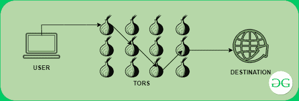
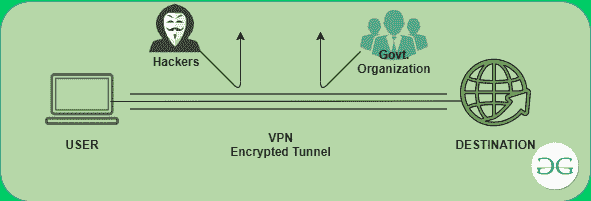

# Tor 和 VPN 的区别

> 原文:[https://www . geeksforgeeks . org/tor 和 vpn 的区别/](https://www.geeksforgeeks.org/difference-between-tor-and-vpn/)

Tor 和 VPN 用于在您通过在线连接到世界时保护隐私。TOR 和 VPN 都有各自的特点，都有一些优点和缺点。在它们之间做出选择取决于你的任务，在本文中我们将讨论它们之间的差异，并通过适当的描述来突出两者的优缺点。

**Tor:** 它允许用户在使用互联网时保护自己的隐私和安全。它为用户提供匿名性。通过使用 Tor，没有服务器可以知道你的身份和你在互联网上做什么。它有多层加密。它在随机选择的节点之间传递信息。虽然每个节点都知道信号的起点和去向，但它无法描绘出整个路径。意味着每个节点只有两个地址来源和目的地。这是一种[洋葱路由。](https://www.geeksforgeeks.org/onion-routing/)

*   **工作概念:** Tor 尝试了“洋葱定向”策略的想法，即首先对客户端信息进行加扰，然后通过 Tor 网络中的各种传输进行移动，随后进行多层加密，以这种方式保护客户端的身份。一个加密层在每个逐级 Tor 中继处被解码，其余信息被发送到任何不规则中继，直到它到达其目的地服务器。对于目标服务器，最后一个 Tor 节点中继(即出口中继)显示为信息的起点，如下图所示。

*   **优势:**
    1.  Tor 完全匿名。
    2.  Tor 通过隐藏你的 ip 保护你免受黑客攻击，他们无法追踪你。
    3.  关闭公共赞助非常困难，这就是网络被分发的原因。
    4.  Tor 有一个注重隐私的搜索引擎。
*   **劣势:**
    1.  一些防火墙阻止通过 Tor 发送的请求。
    2.  与任何虚拟专用网相比，它非常慢，因为它使用了许多层来保护您的隐私。
    3.  Tor 设备兼容性低。
    4.  数据没有加密。数据是匿名传送的，但是浏览器软件包含漏洞，尤其是当看到 HTTP 站点而不是加密的 HTTPS 站点时。

[**VPN**](https://www.geeksforgeeks.org/types-of-virtual-private-network-vpn-and-its-protocols/) **:**

虚拟专用网代表

**虚拟专用网**

它通过一个不太安全的网络创建一个安全和加密的连接。当用户连接到虚拟专用网络时，他/她的所有数据和流量都通过该网络路由。通过连接到虚拟专用网络，IP 地址也会随着服务器的地址而改变。它的服务器分布在全球多个国家。

*   **工作原理:**VPN 的工作原理是通过挑选的 VPN 专用服务器来引导用户设备的互联网连接，而不是 ISP，因此当用户的信息传输到网络时。它起源于虚拟专用网，而不是用户的电脑。虚拟专用网作为用户与网络接口的中间人，以这种方式隐藏用户的 IP 地址并保护身份。虚拟专用网建立了一个从个人电脑到网络的专用隧道，并通过加密隐藏了重要信息。

*   **优势:**
    1.  与大多数设备兼容。
    2.  完全匿名。
    3.  提供顶级加密协议。
    4.  有助于绕过地理区块。
    5.  防止带宽限制。
    6.  绕过防火墙。
*   **劣势:**
    1.  虚拟专用网有弱加密。
    2.  虚拟专用网不是完全免费的，你必须付费才能使用。
    3.  软件故障问题。
    4.  使用错误的虚拟专用网络会危及隐私。
    5.  VPN 连接有时会中断。
    6.  在虚拟专用网中，很难检查加密的质量。

**Tor 和 VPN 的区别:**

<figure class="table">

| 突岩 | 虚拟专用网络 |
| Tor 可以免费下载和使用。 | 虚拟专用网不是完全免费的，你必须付费才能使用它的所有功能。 |
| Tor 会增加延迟并降低带宽。 | 虚拟专用网可以增加带宽，但通常会略微减少带宽，并增加延迟。 |
| Tor 是分散的。 | VPN 是集中式的。 |
| P2P 活动不建议使用 Tor。 | P2P 活动推荐使用 VPN。 |
| Tor 并不兼容所有设备。 | VPN 兼容所有设备。 |
| Tor 无法保护所有在线连接。 | 但是虚拟专用网可以保护所有在线连接。 |
| 由于洋葱路由，Tor 比 VPN 慢。 | 虚拟专用网比 Tor 更快。 |

</figure>