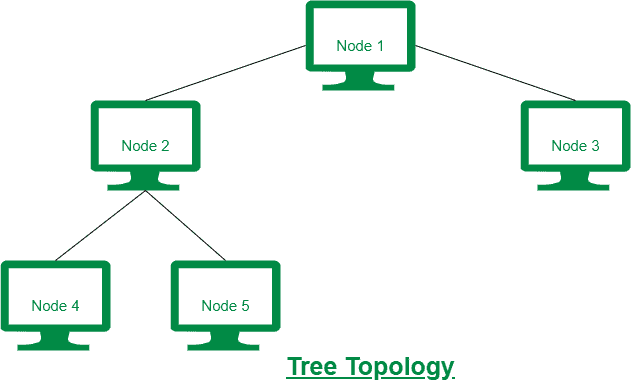
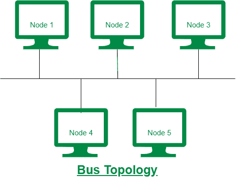

# 树形拓扑和总线拓扑的区别

> 原文:[https://www . geesforgeks . org/树拓扑和总线拓扑的区别/](https://www.geeksforgeeks.org/difference-between-tree-topology-and-bus-topology/)

**1。树拓扑:**
树拓扑是一种网络拓扑，其中节点以树的形式排列。在树形拓扑中，分支电缆从顶部的节点开始，称为根节点。没有环路的分支电缆以分层方式将根节点与所有其他节点连接起来进行通信。树型拓扑更昂贵，因为它布线密集。

**2。总线拓扑:**
总线拓扑是一种网络拓扑，其中每个包含的节点都连接到作为网络主干的单根主电缆。在总线拓扑中，节点之间的通信是通过主网线完成的。总线拓扑非常便宜，因为使用了一根连续电缆。

树形拓扑和总线拓扑的区别如下:

| 没有。 | 树形布局 | 总线拓扑 |
| --- | --- | --- |
| 1. | 在树拓扑中，节点以树的形式组织。 | 在总线拓扑中，每个包含的节点都连接到一根称为主干的电缆。 |
| 2. | 树形拓扑提供了高安全性。 | 而总线拓扑的安全性很低。 |
| 3. | 与总线拓扑相比，树形拓扑很难理解。 | 就复杂性而言，总线拓扑是最简单的。 |
| 4. | 树形拓扑也称为层次拓扑。 | 总线拓扑也称为线路拓扑。 |
| 5. | 树形拓扑昂贵，因为它布线密集。 | 总线拓扑非常便宜，因为使用了一根连续电缆。 |
| 6. | 树形拓扑用于广域网。 | 总线拓扑通常适合局域网，因为安装很容易。 |

