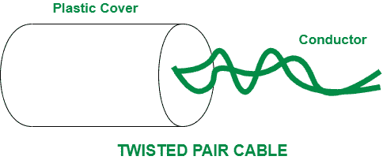
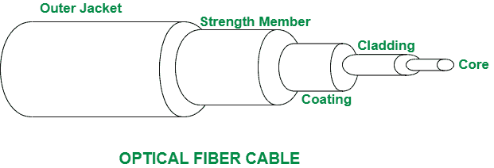

# 双绞线和光缆的区别

> 原文:[https://www . geesforgeks . org/双绞线电缆和光纤电缆的区别/](https://www.geeksforgeeks.org/difference-between-twisted-pair-cable-and-optical-fiber-cable/)

先决条件–[传输媒体类型](https://www.geeksforgeeks.org/types-transmission-media/)
**1。双绞线电缆:**
双绞线电缆是一种将两根导线绞在一起形成电路进行传输的布线方式。它由两根独立的绝缘铜线组合而成。双绞线电缆中的金属导线用于以电信号形式传输数据。双绞线是局域网中所有电缆中最便宜的电缆。双绞线电缆通常用于数据网络和电线屏蔽。

**2。光缆:**
光缆是一类用于长距离传输和高性能数据联网的导向介质。光缆由聚集在一根光缆中的非常细的玻璃纤维组成。在光缆中，玻璃纤维有助于以光脉冲的形式传输信号。光缆主要用于长距离网络和大容量数据中心。

双绞线电缆和光缆的区别如下:

| 没有。 | 双绞线电缆 | 光导纤维电缆 |
| --- | --- | --- |
| one | 在双绞线电缆中，信号通过金属导线传输。 | 在光缆中，信号通过玻璃纤维传输。 |
| 2. | 与光缆相比，双绞线电缆的直径较大。 | 光缆因其薄而柔韧而直径小。 |
| 3. | 在双绞线电缆中，衰减非常大。 | 而在光缆中，衰减非常小。 |
| 4. | 双绞线易于安装和实施。 | 光缆的安装和实施极其困难。 |
| 5. | 双绞线电缆用于电线屏蔽和数据网络。 | 光缆通常适用于城市和国家之间的长途网络。 |
| 6. | 双绞线电缆相对便宜。 | 而光缆价格昂贵，因为它具有很好的性能和容量。 |

