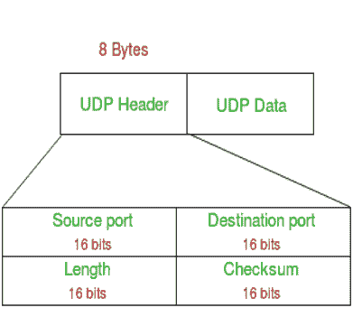
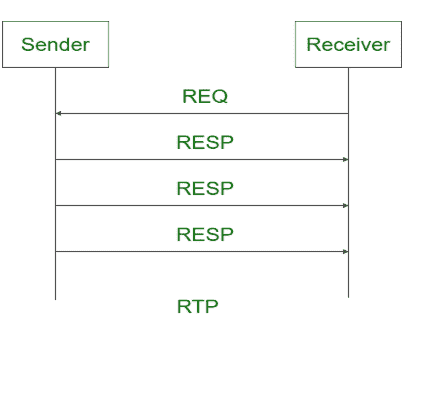

# UDP 和 RTP 的区别

> 原文:[https://www . geesforgeks . org/UDP 和-rtp 之间的差异/](https://www.geeksforgeeks.org/difference-between-udp-and-rtp/)

**1。[用户数据报协议(UDP)](https://www.geeksforgeeks.org/user-datagram-protocol-udp/) :**
UDP 是一种传输层协议。它是互联网协议套件的一部分，称为 UDP/IP 套件。这是一个不可靠的无连接协议。因此，不需要在数据传输之前建立连接。UDP 套接字是数据报套接字的一个例子。它在多播和广播中更有效。

**2。[实时传输协议(RTP)](https://www.geeksforgeeks.org/real-time-transport-protocol-rtp/) :**
实时传输协议(RTP)是一种用于通过网络传送音频和视频的互联网协议。它基本上用于涉及流媒体的通信和娱乐系统。

**UDP 和 RTP 的区别:**

| 没有。 | 用户数据报协议(User Datagram Protocol) | 实时位置（Real-TimePosition 的缩写） |
| 1. | 代表用户数据报协议。 | 实时传输协议代表实时传输协议。 |
| 2. | UDP 是面向数据报的协议。这是因为不存在打开连接、维护连接和终止连接的开销。 | RTP 是一种互联网协议，用于通过网络传送音频和视频。 |
| 3. | 这是一种无连接协议。 | 这是一个无状态协议。 |
| 4. | 相比之下，UDP 更慢、更简单、效率更低。 | RTP 比 UDP 更快、更简单、更高效。 |
| 5. | UDP 用于实时流。 | 实时传输协议用于实时流传输。 |
| 6. | 它不会重传丢失的数据包。 | 它可以容忍数据包丢失。 |
| 7. | 它支持广播和多播。 | 它还支持广播和多播。 |
| 8. | UDP 不可靠。 | RTP 不太可靠。 |

