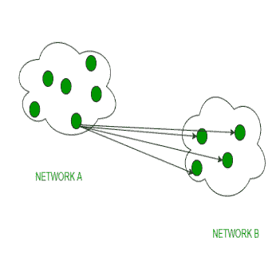

# 单播和广播的区别

> 原文:[https://www . geesforgeks . org/单播和广播的区别/](https://www.geeksforgeeks.org/difference-between-unicast-and-broadcast/)

**1。单播:**
单播是一种信息传输类型，在单个发送方和单个接收方参与的情况下使用。所以，简而言之，你可以称之为一对一映射。例如，网络中 IP 地址为 10.1.4.0 的设备想要将流量流(数据包)发送到另一个网络中 IP 地址为 20.14.4.2 的设备，然后单播进入画面。这是网络上最常见的数据传输形式。

**2。广播:**
广播传送(一对全)技术，可分为两种类型:有限广播、直接广播。在广播模式下，传输从一台主机传输到局域网上连接的所有其他主机。像 bridge 这样的设备就使用了这个。像 ARP 这样的协议实现了这一点，以便知道主机对应的 IP 地址的媒体访问控制地址。ARP 进行 ip 地址到 mac 地址的转换。RARP 则相反。

**单播和广播的区别:**

| 没有。 | 单播 | 广播 |
| 1. | 它有一个发送者和一个接收者。 | 它有一个发送者和多个接收者。 |
| 2. | 它将数据从一台设备发送到另一台设备。 | 它将数据从一台设备发送到网络中的所有其他设备。 |
| 3. | 它适用于单节点拓扑。 | 它适用于星型和总线拓扑。 |
| 4. | 它不适用于流媒体。 | 它可以在大型网络中很好地扩展。 |
| 5. | 相比之下，多路传输使用更多的带宽。 | 它的带宽被浪费了。 |
| 6. | 网上冲浪，文件传输是单播的一个例子。 | 集线器是广播设备的一个例子。 |
| 7. | 它有一对一的映射。 | 它具有一对一的映射。 |

