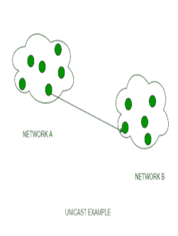
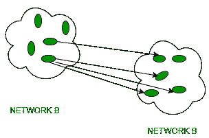

# 单播和组播的区别

> 原文:[https://www . geesforgeks . org/单播和多播的区别/](https://www.geeksforgeeks.org/difference-between-unicast-and-multicast/)

**1。单播:**
单播是一种信息传输类型，在单个发送方和单个接收方参与的情况下使用。所以，简而言之，你可以称之为一对一映射。例如，网络中 IP 地址为 10.1.4.0 的设备想要将流量流(数据包)发送到另一个网络中 IP 地址为 20.14.4.2 的设备，然后单播进入画面。这是网络上最常见的数据传输形式。

**2。[组播](https://www.geeksforgeeks.org/multicasting-in-computer-network/) :**
组播有一个/多个发送方和一个/多个接收方参与数据传输流量。在多播中，流量位于单播和广播的边界之间。它是服务器数据流的直接单一副本，然后被模拟并路由到请求它的主机。IP 组播需要其他一些协议的支持，如[互联网组管理协议(IGMP)](https://www.geeksforgeeks.org/what-is-igmpinternet-group-management-protocol/) ，组播路由才能工作。而且在有类 IP 寻址中，D 类是为多播组保留的。

**单播和组播的区别:**

| 没有。 | 单播 | 多点传送 |
| 1. | 它有一个发送者和一个接收者。 | 它有一个或多个发送器和多个接收器。 |
| 2. | 它将数据从一台设备发送到另一台设备。 | 它将数据从一台设备发送到多台设备。 |
| 3. | 它适用于单节点拓扑。 | 它适用于星形、网状、树形和混合拓扑。 |
| 4. | 它不适用于流媒体。 | 它不能在大型网络中很好地扩展。 |
| 5. | 相比之下，多路传输使用更多的带宽。 | 它有效地利用带宽。 |
| 6. | 网上冲浪，文件传输是单播的一个例子。 | 交换机是组播设备的一个例子。 |
| 7. | 它有一对一的映射。 | 它有一对多映射。 |

