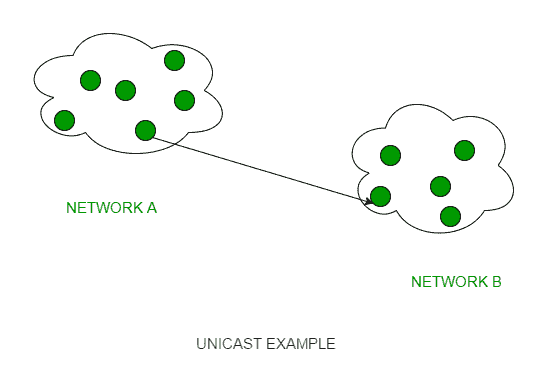
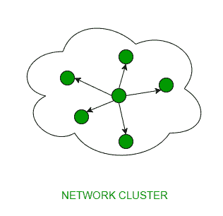
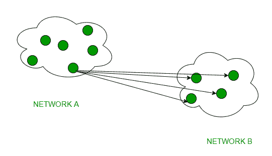

# 计算机网络中单播、广播和组播的区别

> 原文:[https://www . geesforgeks . org/计算机网络中单播-广播-多播的区别/](https://www.geeksforgeeks.org/difference-between-unicast-broadcast-and-multicast-in-computer-network/)

**cast** 术语在这里表示一些数据(数据包流)正在通过帮助它们通信的通信信道从客户端传输到接收者。让我们来看看计算机网络领域流行的一些“演职人员”概念。

### 1.单播–

当只有一个发送者和一个接收者参与时，这种类型的信息传递是有用的。所以，简而言之，你可以称之为一对一传输。例如，网络中 IP 地址为 10.1.2.0 的设备想要将流量流(数据包)发送到另一个网络中 IP 地址为 20.12.4.2 的设备，然后单播进入画面。这是网络上最常见的数据传输形式。

### 2.广播–

广播传输(一对全)技术可以分为两种类型:

*   **Limited Broadcasting –** 
    Suppose you have to send stream of packets to all the devices over the network that you reside, this broadcasting comes handy. For this to achieve, it will append 255.255.255.255 (all the 32 bits of IP address set to 1) called as **Limited Broadcast Address** in the destination address of the datagram (packet) header which is reserved for information transfer to all the recipients from a single client (sender) over the network. 

*   **直接广播–**
    当一个网络中的设备想要通过另一个网络向所有设备传输数据包流时，这非常有用。这是通过将目的地址的所有主机标识部分转换为 1 来实现的，该地址在信息传输的数据报报头中称为**直接广播地址**。

这种模式主要被电视网络用于视频和音频分发。
计算机网络中这一类的一个重要协议是[地址解析协议(ARP)](https://www.geeksforgeeks.org/computer-network-arp-works/) ，用于将 IP 地址解析为底层通信所必需的物理地址。

### 3.多播–

在多播中，一个或多个发送者和一个或多个接收者参与数据传输业务。在这种方法中，流量位于单播(一对一)和广播(一对一)的边界之间。多播允许服务器直接复制数据流，然后模拟并路由到请求它的主机。IP 组播的工作需要其他一些协议的支持，比如 **IGMP(互联网组管理协议)，组播路由**。同样在有类 IP 寻址中**D 类**是为多播组保留的。

**问题角–**

练习下列问题将帮助你测试你的知识。强烈建议你练习一下。

1.  [直播地址](https://www.geeksforgeeks.org/computer-networks-ip-addressing-question-3/)
2.  [直播地址](https://www.geeksforgeeks.org/computer-networks-ip-addressing-question-4/)
3.  [直播地址](https://www.geeksforgeeks.org/computer-networks-ip-addressing-question-5/)

**参考文献–**

[单播、广播和组播的区别](https://serverfault.com/questions/279482/what-is-the-difference-between-unicast-anycast-broadcast-and-multicast-traffic)T2[T4
单播、组播和广播的区别](http://www.erg.abdn.ac.uk/users/gorry/course/intro-pages/uni-b-mcast.html)

本文由 **Vivek Reddy** 供稿。如果你喜欢 GeeksforGeeks 并想投稿，你也可以使用[contribute.geeksforgeeks.org](http://www.contribute.geeksforgeeks.org)写一篇文章或者把你的文章邮寄到 contribute@geeksforgeeks.org。看到你的文章出现在极客博客主页上，帮助其他极客。

如果你发现任何不正确的地方，或者你想分享更多关于上面讨论的话题的信息，请写评论。