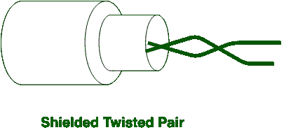

# 非屏蔽双绞线(UTP)和屏蔽双绞线(STP)电缆的区别

> 原文:[https://www . geesforgeks . org/非屏蔽双绞线-utp 和屏蔽双绞线-stp 电缆的区别/](https://www.geeksforgeeks.org/difference-between-unshielded-twisted-pair-utp-and-shielded-twisted-pair-stp-cables/)

**UTP:**
UTP 是双绞线电缆的类型。它代表非屏蔽双绞线。数据和语音都通过 UTP 传输，因为它的频率范围合适。在 UTP，接地电缆不是必需的，在 UTP，也不需要更多的维护，因此成本效益高。

**STP:**
STP 也是双绞线的类型，代表屏蔽双绞线。在 STP 中需要接地电缆，但在 UTP 不需要。在屏蔽双绞线中，需要更多的维护，因此比非屏蔽双绞线(UTP)更昂贵。

**非屏蔽双绞线(UTP)和屏蔽双绞线(STP)电缆的区别:**

<figure class="table">

| S.NO | UTP | 短时程增强 |
| 1. | UTP 代表非屏蔽双绞线。 | STP 代表屏蔽双绞线。 |
| 2. | 在 UTP，接地电缆是不必要的。 | 而在 STP 中则需要接地电缆。 |
| 3. | 与 STP 相比，UTP 的数据速率较慢。 | STP 中的数据速率很高。 |
| 4. | UTP 的成本更低。 | 而 STP 比 UTP 贵。 |
| 5. | 在 UTP，不需要更多的维护。 | 而在 STP 中，需要更多的维护。 |
| 6. | 在 UTP，噪音比 STP 高。 | 而在 STP 中噪声较小。 |
| 7. | 在 UTP，与 STP 相比，相声的产生也很高。 | 而在 STP 中产生的串扰也较少。 |
| 8. | 在 UTP，与 STP 相比，衰减较高。 | 而在 STP 中衰减很低。 |
| 9. | 在 UTP，提供的速度约为 10 到 1000 兆位/秒。 | 而在 STP 中，提供的速度约为 10 到 100 Mbps。 |
| 10. | 它用于短距离内的数据传输，例如家庭和办公室网络。 | 通常用于远距离连接组织。 |

</figure>