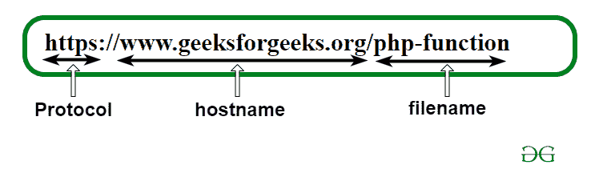

# 网址和链接的区别

> 原文:[https://www . geesforgeks . org/URL 和链接的区别/](https://www.geeksforgeeks.org/difference-between-url-and-link/)

**1。[统一资源定位符(URL)](https://www.geeksforgeeks.org/url-full-form/):**
URL 代表统一资源定位符，它为互联网上的每个资源指定不同的地址。因此，简单地说，它们就是网络或互联网所处的位置。

**2。链接:**
它是一个电子文档形式的元素，链接到相同或不同文档中的其他位置。这是超级链接的一个简短形式。因此，只需单击或点击它，它们就允许您移动到一个新的位置，该位置称为网址。

**网址和链接的区别:**

| 统一资源定位器 | 环 |
| --- | --- |
| 它是在 HTML 锚元素中定义的。 | 它也在 HTML 锚元素中定义。 |
| 它代表统一资源定位器。 | 它是超链接的简称。 |
| 它们是具体的地址。 | 它们是网址的相对路径。 |
| 它是嵌入到所需资源链接中的信息。 | 这是你接触资源的方式。 |
| 它们为网络内容提供名称。 | 它们是页面本身的内容。 |
| 它们帮助我们使链接更加易于管理。 | 它们的帮助是帮助数据是在搜索结果中为你的博客带来更多可见性的有用数据。 |
| 它有助于跟踪编译点击数据。 | 他们帮助你接收链接到其他网站的流量。 |
| 网址很容易移动，因为它们可以从任何社交媒体服务转移或转移到任何社交媒体服务。 | 他们有一个动态的数据结构。 |
| 它们有助于追踪向用户提供数据有用特征的情况。 | 它们有助于非常容易地插入和删除节点。 |
| 网址也有助于促进分享。 | 它们非常容易实现。 |
| 他们有能力跟踪每个共享链接的点击。 | 它们有助于减少内存浪费，因为在链接运行时没有内存浪费有助于跟踪。 |

