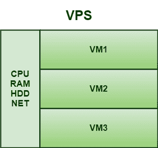
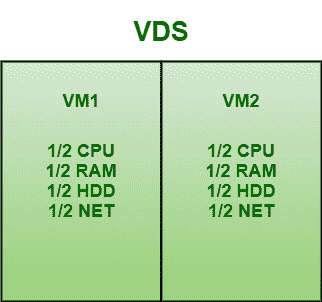

# VPS 和 VDS 的区别

> 原文:[https://www . geesforgeks . org/VPS 和-vds 之间的区别/](https://www.geeksforgeeks.org/difference-between-vps-and-vds/)

**1。虚拟专用服务器(VPS) :**
VPS，顾名思义，是一种虚拟主机，模拟共享服务器中的专用服务器环境。它使用从操作系统级别工作的虚拟化层，一些流行的虚拟专用网选项，如 OpenVZ，使用基于 Linux 内核的技术。它提供了一些可伸缩性，即可以从有限的资源开始，然后根据需要进行扩展。

**2。虚拟专用服务器(VDS) :**
VDS，顾名思义，是一个虚拟机，它为用户提供了租用托管但专用的服务器来构建、部署和托管 web 应用程序的能力。它不与其他客户共享，因此不提供任何多租户环境。每个 VDS 都有自己的磁盘位置、CPU 分配、内存、带宽和操作系统。它通常依赖于虚拟机管理程序来创建逻辑分区级别。它还提供了一组专用的资源，一个人可以访问，而不需要与其他租户共享。

**VPS 和 VDS 的区别:**

<figure class="table">

| 

**VPS**

 | 

VDS

 |
| --- | --- |
| 它是位于物理服务器之上的虚拟机，托管虚拟专用网实例并共享主机资源。 | 它提供远程专用服务器。 |
| 虚拟专用网是一种配置为托管多个服务器实例的服务器。 | VDS 实例占用了整个服务器。 |
| 与 VDS 相比，它更具成本效益。 | 与 VPS 相比，它的成本效益较低。 |
| 与 VDS 相比，它通常具有一定的可扩展性和卓越的便利性。 | 它没有提供可伸缩性和卓越的便利性。 |
| 它使用 OpenVZ 技术，其中 OpenVZ 基本上是操作系统级别的虚拟化，其主要优势是工作速度。 | 它使用 KVM 技术，允许为访客和 VNC 安装操作系统，允许运行虚拟服务器，就像桌面计算机的一部分。 |
| 在托管术语中，使用操作系统级虚拟化创建的虚拟机称为虚拟专用网。 | 在托管术语中，使用半虚拟化创建的虚拟机被称为 VDS。 |
| 与 VDS 相比，它提供的功能较少。 | 与虚拟专用网相比，它提供了更好的功能。 |
| 其操作由操作系统管理和控制。 | 其操作由服务器硬件管理和控制。 |
| 它具有多租户环境，即客户端可以单独访问虚拟专用服务器环境，但它们与两个或更多客户端共享硬件。 | 它具有单租户环境，即只有一个客户端可以访问硬件。 |
| 它适用于低负载任务，如连接远程桌面和与办公应用程序的集体工作，部署小型电子商务、公司网站等。 | 对于流媒体影音应用、游戏服务器、流量增加的高负载应用、大型电商项目等都不好。 |

</figure>