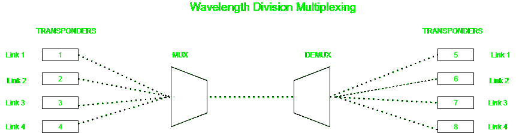

# WDM 和 SONET 的区别

> 原文:[https://www . geeksforgeeks . org/WDM 和 sonet 之间的差异/](https://www.geeksforgeeks.org/difference-between-wdm-and-sonet/)

在本文中，我们将讨论波分复用(WDM)和同步光网络(SONET)的区别。我们一个一个来讨论。

**1。[波分复用(WDM)](https://practice.geeksforgeeks.org/problems/what-is-wdm):**T4】WDM 代表波分复用。这是一种光纤传输技术，便于使用多种光波长(或颜色)在同一介质上发送数据。在一根光纤上，两种或更多种颜色的光可以传播，几个信号可以在光波导中以不同的波长或光谱上的不同频率传输。

**2。[同步光网络(SONET)](https://www.geeksforgeeks.org/synchronous-optical-network-sonet/) :**
SONET 代表同步光网络。这是一种由 Bellcore 开发的通信协议，用于通过使用光纤在相对较大的距离上传输大量数据。通过使用这种方法，可以通过光纤同时传输多个数字数据流。

**WDM 和 SONET 的区别:**

| 没有。 | WDM | 同步光纤网(Synchronous Optical Network) |
| 1. | WDM 使用许多光源，每一个都发出不同波长的光。 | SONET 是一种光传输接口。 |
| 2. | 光学多路复用器在输入端用于多路复用这些信号。 | SONET 将许多光信号聚合成更高比特率的信号，以便使用单个波长在单根光纤上传输。 |
| 3. | 这通过多路复用多个波长信道来提高光缆承载数据的能力。 | 这些技术被用作更高层的缓冲(接口)层。 |
| 4. | 所有信号同时到达，而不是分布在不同的时隙。 | 它使用时分复用或统计时分复用。 |
| 5. | 沟道间距减小到 1.6 纳米或更小。 | 信道间隔可以在 WDM 传播，但不能反过来传播。 |
| 6. | 传送的频道数为 2。 | 从多路复用电路中隔离一个通道很容易。 |
| 7. | 最好的应用是 PON。 | 最好的应用是以太网电缆或公共电话网络。 |
| 8. | 这里用的乐队是 O 和 c。 | 这里使用的波段是 STS-1，具有固定大小的帧。 |

