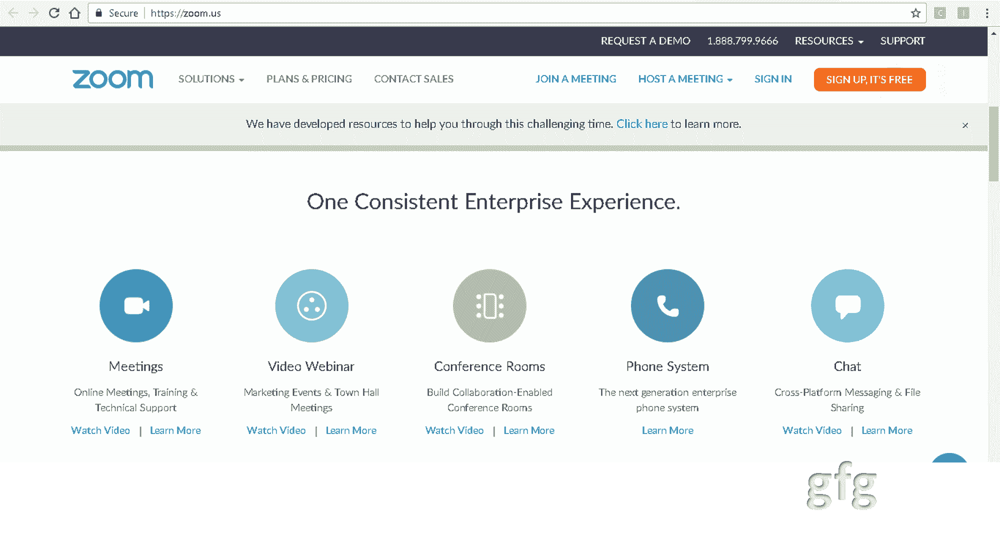
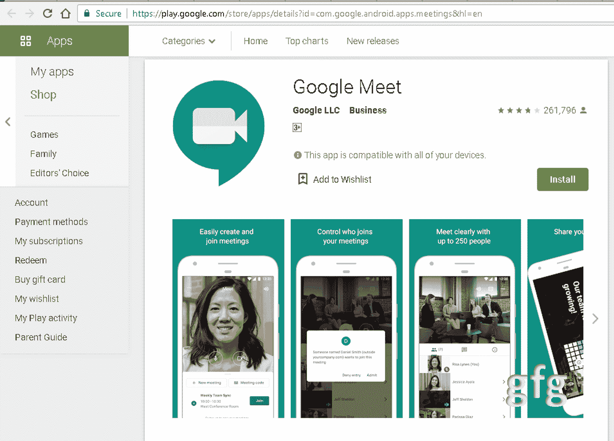

# 【Zoom 和 Google Meet 的区别

> 原文:[https://www . geeksforgeeks . org/zoom-and-Google-meet 的区别/](https://www.geeksforgeeks.org/difference-between-zoom-and-google-meet/)

**1。Zoom :**
由 Zoom 视频通信公司开发，Zoom 是一款基于云的对等软件，用于远程会议、传授远程教育和维护社交关系。这是最近出现的最简单的视频会议工具之一。由于其安全漏洞和端到端加密的虚假声明，该公司最近一直在接受审查，该公司已有效处理了这些问题。在与朋友或家人在线开会和视频聊天的情况下，它非常受欢迎。

**2。
谷歌会议:这是一款视频会议软件。它是由谷歌公司在 2017 年开发的。它可以在安卓、iOS 和网络平台上无缝运行。它最多可以有 100 名免费参与者，时间限制为 60 分钟。它可以在特定时间有 16 个人在屏幕上。它有一个非常安全和稳健的系统，智能背景噪音过滤。**

**Zoom 和 Google Meet 的区别:**

| 没有。 | 一款云视频会议软件 | 谷歌见面 |
| --- | --- | --- |
| 1. | 没有必要下载任何应用程序，因为它也可以从网站访问。 | 应用程序下载是必要的。 |
| 2. | 你可以修饰一下你的外表。 | 这没有面部修饰。 |
| 3. | 音频通话、视频通话和聊天功能可用。 | 它有电话，视频通话和聊天设施。 |
| 4. | 它可以在台式机、个人电脑、安卓和苹果设备上访问。 | 安卓或 iOS 设备上的桌面版本或应用可用。 |
| 5. | 它有可定制的虚拟背景。 | 它没有后台定制。 |
| 6. | 可以通过使用虚拟背景特征来提供房间的私密性。 | 如果你在家工作，就没有隐私可言。 |
| 7. | 它可以处理多达 100 名参与者。 | 250 名参与者可以在其中协作。 |
| 8. | 里面允许 40 分钟的视频通话。 | 它允许 60 分钟的视频通话。 |
| 9. | 它推出了从 14.99 美元起的免费和付费版本。 | 付费版每月花费在 6 到 12 美元之间。 |
| 10. | 屏幕上一次可以有 49 个人。 | 它一次最多有 16 个人在屏幕上。 |
| 11. | 它集成了电子邮件和日历。 | 它与谷歌文档、谷歌驱动、谷歌表单和谷歌笔记集成在一起。 |
| 12. | 它对会议进行了完全加密，并对参加会议的人员进行了主机控制。应用程序中存在等候室功能。主机也可以使用报告用户按钮报告用户。 | 非常安全。主持人可以静音、允许或拒绝参与者。它有复杂的会议标识，可以抵御暴力黑客攻击。人们只需在会议前 15 分钟加入，这样做是为了防止[安全攻击](https://www.geeksforgeeks.org/basic-network-attacks-in-computer-network/)。原本没有被邀请的新人，需要向主持人发出参与请求。 |
| 13. | 它最初专注于商业实体，但现在它的目标是朋友、家人以及会议中的客户。 | 它的目标是任何有谷歌账户的人。 |
| 14. | 文档协作是不可能的。 | 不能在办公文档方面进行协作。 |
| 15. | 它不支持从 Gmail 收件箱安排会议。 | 从 Gmail 收件箱直接安排是可能的。 |
| 16. | 它没有噪声过滤。 | 它没有噪声过滤。 |
| 17. | 它有 Zoom 视频通信公司作为开发者。 | 它由谷歌有限责任公司开发。 |
| 18. | 它是在 2013 年开发的。 | 它是在 2017 年 3 月开发的 |

