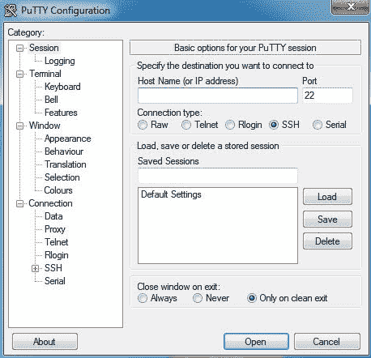

# SSH 和 Telnet 的区别

> 原文:[https://www.geeksforgeeks.org/difference-ssh-telnet/](https://www.geeksforgeeks.org/difference-ssh-telnet/)

如果你已经使用 linux 发行版很长时间了，并且你不再是一个 linux 新手，那么你可能会遇到像 SSH 和 telnet 这样的术语。它们提供的功能非常相似，但是当远程登录已经存在时，SSH 开始发挥作用了吗？

**SSH 或安全外壳**

**SSH 或 Secure SHell** 现在是通过互联网访问网络设备和服务器的唯一主要协议。SSH 是由 SSH 通信安全有限公司开发的，它是一个通过网络登录到另一台计算机，在远程机器上执行命令，以及将文件从一台机器移动到另一台机器的程序。

*   它通过不安全的通道提供强身份验证和安全通信。
*   SSH 默认运行在端口 22；然而，它可以很容易地改变。SSH 是一种非常安全的协议，因为它以加密的形式共享和发送信息，这为互联网等不安全网络上的数据提供了保密性和安全性。
*   一旦用于通信的数据使用 SSH 加密，就极难解密和读取这些数据，因此我们的密码也变得安全，可以在公共网络上传输。
*   SSH 还使用公钥对访问服务器的用户进行身份验证，这是一个很好的实践，为我们提供了极高的安全性。SSH 主要用于所有流行的操作系统，如 Unix、Solaris、红帽 Linux、CentOS、Ubuntu 等。
*   SSH 保护网络免受 IP 欺骗、IP 源路由和 DNS 欺骗等攻击。成功接管网络的攻击者只能强制 ssh 断开连接。当启用加密时，他或她不能回放流量或劫持连接。
*   当使用 ssh 的 slogin(而不是 rlogin)时，整个登录会话，包括密码的传输，都是加密的；因此，外人几乎不可能收集密码。

OpenSSH 客户端和服务器应用程序的安装更简单。
要将其安装在您的 Ubuntu 系统上，请在终端提示符下使用以下命令:

```
$sudo apt-get update
$sudo apt install openssh-client
```

要安装 OpenSSH 服务器应用程序和相关支持文件，请在终端提示符下使用以下命令:

```
$sudo apt-get update
$sudo apt install openssh-serve
```

差不多就是这样！简单不？

**远程登录**

**Telnet** 是**电信和网络**的联合缩写，是 UNIX 平台最著名的网络协议。Telnet 使用端口 23，它是专门为局域网设计的。

*   当网络在 1969 年第一次启动时，Telnet 作为最初的互联网而闻名，它被构建成一种远程控制的形式，从远程终端管理大型计算机。在大型主机计算机的最初时代，telnet 使研究学生和教授能够从大楼的任何终端“登录”到大学主机。
*   这种远程登录每学期为研究人员节省了数小时的步行时间。尽管 telnet 与现代网络技术相比相形见绌，但它在 1969 年是革命性的，并在 1989 年为最终的万维网铺平了道路。尽管 telnet 技术非常古老，但今天它仍然被纯粹主义者所使用。
*   telnet**不是一种安全的通信协议**，因为它不使用任何安全机制，并且以包括密码在内的明文形式在网络/互联网上传输数据，因此任何人都可以嗅探数据包以获取重要信息。
*   telnet 中没有使用身份验证策略和数据加密技术，这造成了巨大的安全威胁，这就是为什么 telnet 不再用于通过公共网络访问网络设备和服务器的原因。

在 Ubuntu(一个著名的也是我个人最喜欢的 linux 发行版)上。)
我们可以用以下命令安装 telnet 服务器:

```
$sudo apt-get install xinetd telnetd
```

安装完成后，服务应该会自动启动。如果需要，您还可以使用以下方法检查服务状态:

```
$sudo /etc/init.d/xinetd status
```

要远程登录一个 IP:

```
$telnet serverip
```

如果您想更改其端口，您需要编辑/etc/service，如下所示:

```
$telnet 23/tcp 
```

更改后，重新启动以应用更改:

```
$sudo /etc/init.d/xinetd restart
```

现在，它可能看起来像一些乏味和古怪的终端命令，但如果你试着在你的终端上运行它们一次，相信我，你会发现它非常容易！
和 SSH 一样，Telnet 显然也只是一个枯燥乏味的终端屏幕，但却有着一些难以想象的功能。

**SSH 和 Telnet 的区别**

1.  与远程登录相比，SSH 更安全
2.  SSH **加密数据**，而 Telnet 以纯文本形式发送数据
3.  SSH 使用**公钥进行身份验证**，而 Telnet 不使用任何身份验证
4.  与远程登录相比，SSH 给带宽增加了更多的开销
5.  在几乎所有的应用中，远程登录几乎都被 SSH 取代了
6.  SSH 和远程登录通常服务于相同的目的

最后，还有一些 SSH 客户端，您可以使用该软件与 SSH 服务器建立连接，适用于所有主要操作系统和平板电脑操作系统。

*   苹果 OS X & Linux:内置，终端提供
*   窗户:腻子，其他
*   安卓:JuiceSSH，其他
*   iOS:提示，其他

如果你想把你的 Windows 电脑和 Linux 电脑连接起来，那么你需要一个叫做‘PuTTY’的软件，你可以从[这里](http://www.putty.org/)下载。
安装后看起来会很像这样:



参考文献:[askubuntu.com](https://askubuntu.com/questions/818922/installing-ssh-in-ubuntu-14-04lts)