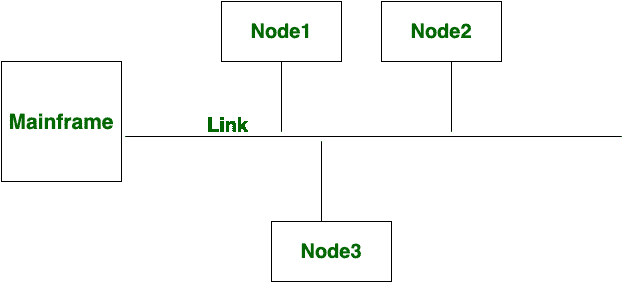

# 点对点和多点通信的区别

> 原文:[https://www . geesforgeks . org/点对点和多点通信之间的差异/](https://www.geeksforgeeks.org/differences-between-point-to-point-and-multi-point-communication/)

在本节中，我们将看到[点对点通信和多点通信](https://www.geeksforgeeks.org/line-configuration-computer-networks/)之间的区别。在点对点通信中，两个节点之间有专用链路，而在多点通信中，始终提供链路以共享节点之间的连接。

现在，借助图表给出这些交流的区别如下:

| S.NO | 点到点通信 | 多点通信 |
| 1. | 点对点通信意味着信道在两个设备之间共享。 | 多点通信意味着信道在多个设备或节点之间共享。 |
| 2. | 在这种通信中，两个节点之间有专用链路。 | 在这种通信中，一直提供链路以在节点之间共享连接。 |
| 3. | 在这种通信中，整个容量都保留在这两个连接的设备之间。 | 在这种交流中，所有的能力都依赖于快速的分享。 |
| 4. | 在这种通信中，有一个发射机和一个接收机。 | 在这种通信中，有一个发射机和许多接收机。 |
| 5. | 在点对点连接中，到达接收器的最小距离是最重要的。 | 在多点连接中，到达接收器的最小距离并不重要。 |
| 6. | 点对点通信提供了安全性和隐私性，因为通信通道是不共享的。 | 多点通信不能提供安全性和隐私性，因为通信通道是共享的。 |
| 6. | 

 | 

 |

