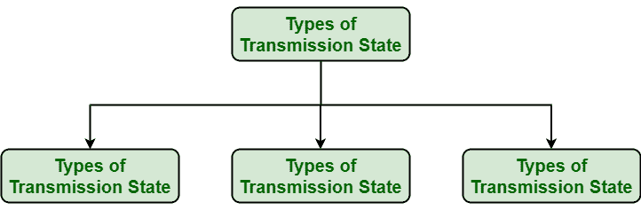
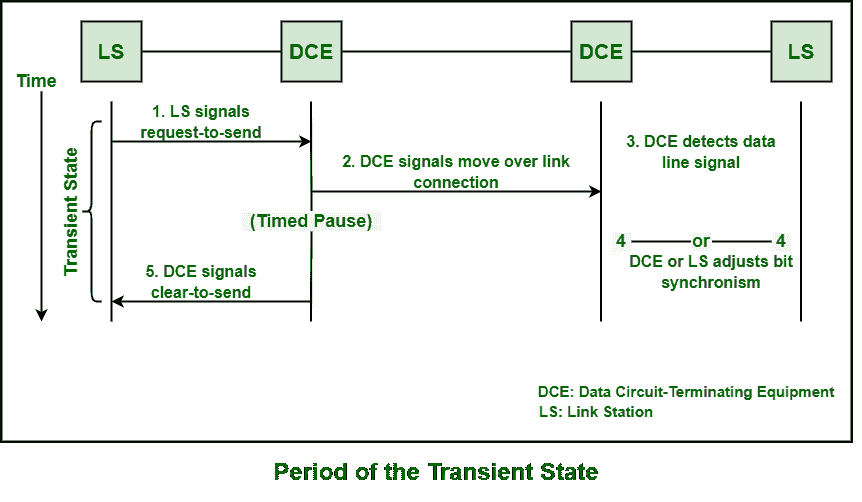

# SDLC 的不同传输状态

> 原文:[https://www . geesforgeks . org/different-transmission-States-of-SDLC/](https://www.geeksforgeeks.org/different-transmission-states-of-sdlc/)

[同步数据链路控制(SDLC)](https://www.geeksforgeeks.org/sdlc-types-and-topologies/) 通常是数据通信信道上逐位串行信息传输的规程。无论是交换的还是非交换的，一旦建立或发展了物理通信信道，它总是被认为是不变的。这个转换通道上的通信通道基本上被认为不是永久性的。在这个通信信道上，基本上有三种不同类型的传输状态可以存在或存在。

如下所示，SDLC 可能存在于这些传输状态之一:

让我们详细了解一下:

1.  **Transient State –**
    This state usually arises when station is preparing itself to transfer and not yet reached steady state. This state also follows the poll of secondary station and come before the actual transfer of control data or information. This state also exists before and after initial transmission and also after each line turnaround.

    

2.  **Idle State –**
    The circuit is basically considered to be in Idle state by secondary station just after 15 or more consecutive logic 1s that must have been received. There is also no transmission of control information or data during this state. A link connection configuration that is being used is required to determine and identify the particular link station action in this state as given below :

    

    | 链接连接 | 主链路站 | 次链路站 |
    | --- | --- | --- |
    | 半双工点对点 | 载波关闭 | 载波关闭 |
    | 双工点对点 | 所有 1 个 | 所有 1 个 |
    | 半双工多点 | 载波关闭 | 载波关闭 |
    | 双工多点 | 所有 1 个 | 载波关闭 |

    

3.  **Active State –**
    It is a non-idle, non-transient state. In this state, there is possibility of transmission of control information and data. This state basically presents whether primary or one of the secondary stations is transferring information or control signals. In the following figure, it is clear that there is no exchange of information or data, but the line is held in this state.

    