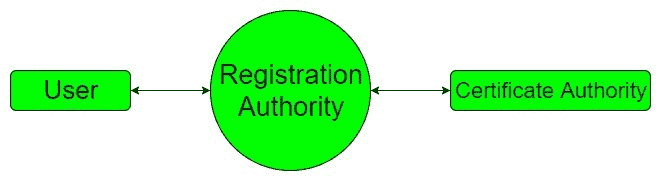
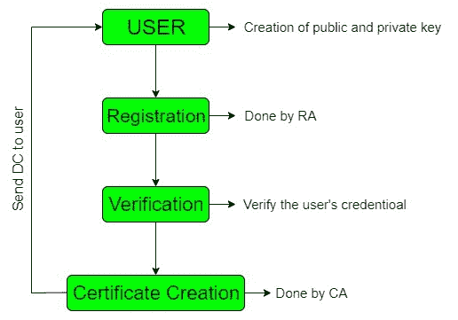

# 数字证书创建

> 原文:[https://www.geeksforgeeks.org/digital-certificate-creation/](https://www.geeksforgeeks.org/digital-certificate-creation/)

创建[数字证书](https://www.geeksforgeeks.org/digital-signatures-certificates/)所需的步骤涉及三方首先是最终用户，其次是注册机构，第三是证书机构。最终用户请求数字证书，该请求到达注册机构，然后注册机构协助证书机构创建数字证书。注册机构充当最终用户和证书机构之间的中介。它还协助认证机构的日常工作。

**登记机关服务:**

*   接受和验证新用户注册的详细信息。
*   用户密钥生成。
*   密钥的备份和恢复。
*   证书取消。

**数字证书创建步骤:**

*   **步骤 1:** 密钥生成由用户或注册机构完成。生成的公钥被发送到注册机构，私钥由用户保密。
*   **步骤-2:** 下一步，注册机构注册用户。
*   **步骤-3:** 下一步是由注册机构完成的验证，其中用户的凭证正由注册机构验证。它还检查发送公钥的用户是否有相应的私钥。
*   **步骤-4:** 在该步骤中，创建数字证书的注册机构将详细信息发送给证书颁发机构，并将其提供给用户，同时保留一份副本给自己。

