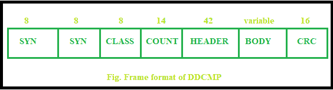
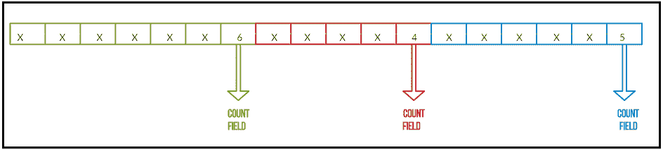
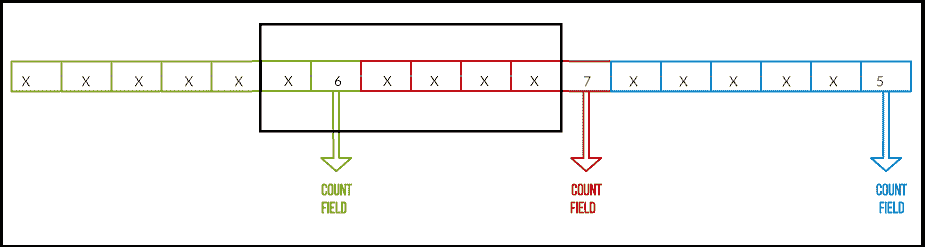

# 数字数据通信消息协议

> 原文:[https://www . geesforgeks . org/digital-data-communication-message-protocol-ddcmp/](https://www.geeksforgeeks.org/digital-data-communications-message-protocol-ddcmp/)

**数字数据通信消息协议(DDCMP)** 是数字设备公司设计的一种面向字节的通信协议和同步数据链路层协议。面向字节的协议将帧视为字节/字符的集合。

一些流行的面向字节的协议是–

1.  二进制同步通信协议
2.  点对点协议
3.  数字数据通信消息协议

数字数据通信消息协议(DDCMP)不同于 BISYNC 和 PPP 协议，因为它采用字节计数方法。这里，计数是指帧格式的计数字段中的字节数。

**DDCMP:帧格式–**

**Figure –** Frame format of DDCMP

*   在帧格式中，有两个各 8 位的同步字段(SYN)(类似于 BISYNC 协议中的同步字段)。
*   一个 8 位的类字段(类似于 PPP 协议中的类字段)。
*   一个 42 位的报头字段。
*   一个 14 位的计数字段，用于计算帧体中的字节数。
*   正文字段的长度可变。
*   16 位的循环冗余校验字段对数据执行错误检测。

**DDCMP 缺点:传输错误–**
传输错误会影响帧中的任何位模式。如果它破坏了计数字段，那么接收器将无法正确检测到帧的结尾。框架结构会变得杂乱。

**示例–**
考虑一下，我们有三帧。

**Figure –** Example of frame format of DDCMP

*   计数字段在每一帧中。
*   让我们考虑框架，在上面的图中绿色绘制的是 F3[框架-3]。这是发送方创建的框架。
*   让我们考虑框架，在上图中用红色绘制的是 F2[框架-2]。
*   让我们考虑帧，在上面的图中画蓝色的是 F1[帧-1]。
*   发送方将信息发送给接收方，接收方首先读取计数字段“5”，并理解接下来的 5 个字节属于一个帧，即 F1[Frame-1]。
*   同样的。它分别读取计数字段“4”和“6 ”,并理解接下来的 4 和 6 字节分别属于两个帧。
*   不幸的是，当传输错误发生时，影响 F2[帧 2]。F2 的计数字段从“4”修改为“7”。因此，接收方理解“7”之后的下一个 7 字节属于一个帧，即 F2[帧-2]，但它不是发送方创建的帧。当接收器将其识别为 F2[Frame-2]时，会发生成帧错误。

在上图中，传输错误以 DDCMP 帧格式为例进行了描述。