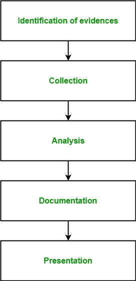

# 信息安全中的数字取证

> 原文:[https://www . geesforgeks . org/digital-forecastics-in-information-security/](https://www.geeksforgeeks.org/digital-forensics-in-information-security/)

**数字取证**是法医学的一个分支，包括识别、收集、分析和报告与计算机犯罪相关的数字设备中的任何有价值的数字信息，作为调查的一部分。

简而言之，数字取证是识别、保存、分析和呈现数字证据的过程。1978 年《佛罗里达计算机法案》承认了第一批计算机犯罪，此后，数字取证领域在 20 世纪 80-90 年代末发展迅速。它包括存储介质、硬件、操作系统、网络和应用程序等分析领域。

它由 5 个高级步骤组成:

1.  **Identification of evidence:**
    It includes of identifying evidences related to the digital crime in storage media, hardware, operating system, network and/or applications. It is the most important and basic step.
2.  **Collection:**
    It includes preserving the digital evidences identified in the first step so that they doesn’t degrade to vanish with time. Preserving the digital evidences is very important and crucial.
3.  **Analysis:**
    It includes analyzing the collected digital evidences of the committed computer crime in order to trace the criminal and possible path used to breach into the system.
4.  **Documentation:**
    It includes the proper documentation of the whole digital investigation, digital evidences, loop holes of the attacked system etc. so that the case can be studied and analysed in future also and can be presented in the court in a proper format.
5.  **出示:**
    包括在法庭上出示所有数字证据和文件，以证明所实施的数字犯罪并识别罪犯。

**数字取证分支机构:**

*   **Media forensics:**
    It is the branch of digital forensics which includes identification, collection, analysis and presentation of audio, video and image evidences during the investigation process.
*   **Cyber forensics:**
    It is the branch of digital forensics which includes identification, collection, analysis and presentation of digital evidences during the investigation of a cyber crime.
*   **Mobile forensics:**
    It is the branch of digital forensics which includes identification, collection, analysis and presentation of digital evidences during the investigation of a crime committed through a mobile device like mobile phones, GPS device, tablet, laptop.
*   **软件取证:**
    它是数字取证的一个分支，仅在与软件相关的犯罪调查过程中包括数字证据的识别、收集、分析和呈现。