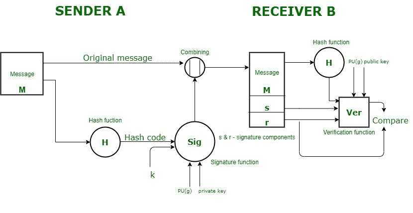

# 数字签名标准(DSS)

> 原文:[https://www . geesforgeks . org/digital-signature-standard-DSS/](https://www.geeksforgeeks.org/digital-signature-standard-dss/)

正如我们所研究的，签名是一种验证来自可信个人的数据的方式。类似地，[数字签名](https://www.geeksforgeeks.org/digital-signatures-certificates/)是一种验证来自可信来源的数字数据的方式。

**数字签名标准(DSS)** 是一个联邦信息处理标准(FIPS)，它定义了借助于[安全散列算法(SHA)](https://www.geeksforgeeks.org/sha-1-hash-in-java/) 生成数字签名的算法，用于电子文档的认证。DSS 只为我们提供数字签名功能，不提供任何加密或密钥交换策略。

**发送方:**
在 DSS 方法中，从消息中生成一个散列码，并向签名功能提供以下输入–

1.  哈希代码。
2.  为该特定签名生成的随机数“k”。
3.  发送方的私钥，即 PR(a)。
4.  全局公钥(这是一组用于通信原理的参数)，即 PU(g)。

函数的这些输入将为我们提供包含两个组件–“s”和“r”的输出签名。因此，与签名连接的原始消息被发送给接收者。

**接收方:**
在接收端，完成对发送方的验证。生成发送消息的哈希代码。有一个采用以下输入的验证功能–

1.  接收器生成的哈希代码。
2.  签名组件“s”和“r”。
3.  发件人的公钥。
4.  全局公钥。

验证函数的输出与签名组件“r”进行比较。如果发送的签名有效，这两个值将匹配，因为只有发送者在私钥的帮助下才能生成有效的签名。