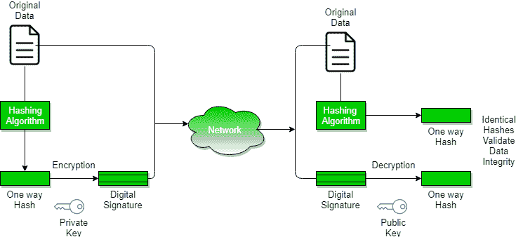

# 数字签名和证书

> 原文:[https://www . geesforgeks . org/digital-signations-certificates/](https://www.geeksforgeeks.org/digital-signatures-certificates/)

**加密**–将电子数据转换成另一种形式的过程，称为密文，除了授权方之外，任何人都不容易理解。这确保了数据安全。
**解密**–将代码转换为数据的过程。

*   消息在发送方使用各种加密算法加密，在接收方借助解密算法解密。
*   当一些信息需要保密时，比如用户名、密码等。，加密和解密技术用于确保数据安全。

**加密类型**

1.  **对称加密**–数据使用密钥加密，解密也使用相同的密钥完成。
2.  **非对称加密**-非对称加密也称为公钥加密。它使用公钥和私钥来加密和解密数据。这对密钥中可以与所有人共享的一个密钥称为公钥。密钥对中的另一个密钥是保密的，只有所有者知道，它被称为私钥。这两个密钥都可以用来加密消息；与用于加密消息的密钥相反的密钥用于解密。

**公钥**–大家都知道的密钥。A 的 ex-公钥是 7，这个信息大家都知道。
**私人钥匙**–只有拥有私人钥匙的人才知道的钥匙。

**认证**-认证是系统验证希望访问它的用户的身份的任何过程。
**不可抵赖**–不可抵赖是指确保声称发送和接收消息的一方已经发送和接收了传输的消息。不可否认性是一种保证消息的发送者不能否认已经发送了消息并且接收者不能否认已经接收了消息的方法。
**完整性**–确保消息在传输过程中没有被更改。
**消息摘要**-以单个数字字符串形式表示的文本，使用称为单向哈希函数的公式创建。用私钥加密消息摘要会创建数字签名，这是一种电子认证方式..

**数字签名**

数字签名是一种数学技术，用于验证消息、软件或数字文档的真实性和完整性。

1.  **密钥生成算法**:数字签名是电子签名，它保证消息是由特定的发送者发送的。在执行数字交易时，应确保真实性和完整性，否则，数据可能会被篡改，或者有人可能会表现得像发送者一样，期待回复。
2.  **签名算法**:为了创建数字签名，像电子邮件程序这样的签名算法会创建要签名的电子数据的单向散列。然后，签名算法使用私钥(签名密钥)加密哈希值。这种加密的散列和散列算法等其他信息一起就是数字签名。该数字签名被附加到数据中，并被发送给验证者。加密散列而不是整个消息或文档的原因是散列函数将任意输入转换成短得多的固定长度值。这节省了时间，因为现在不是签署一个长消息，而是签署一个较短的散列值，而且散列比签署快得多。
3.  **签名验证算法**:验证者接收数字签名和数据。然后使用验证算法对数字签名和公钥(验证密钥)进行处理，并生成一些值。它还对接收到的数据应用相同的散列函数，并生成一个散列值。然后比较哈希值和验证算法的输出。如果两者相等，则数字签名有效，否则无效。

**创建数字签名的步骤如下:**

1.  通过对消息应用散列函数来计算消息摘要，然后使用发送者的私钥对消息摘要进行加密以形成数字签名。(数字签名=加密(发送者的私钥，消息摘要)和消息摘要=消息摘要算法(消息))。
2.  数字签名随消息一起传输。(传输消息+数字签名)
3.  接收者使用发送者的公钥解密数字签名。(这保证了真实性，因为只有发送者有他的私钥，所以只有发送者可以用他的私钥加密，这样就可以用发送者的公钥解密)。
4.  接收者现在有了消息摘要。
5.  接收者可以从消息中计算出消息摘要(实际消息是用数字签名发送的)。
6.  接收者计算的消息摘要和消息摘要(通过数字签名解密获得)需要相同，以确保完整性。

使用单向散列函数计算消息摘要，即散列函数，其中计算消息的散列值很容易，但是根据消息的散列值计算消息非常困难。

**数字证书**

数字证书由可信的第三方颁发，它向接收者证明发送者的身份，向发送者证明接收者的身份。
数字证书是由证书颁发机构(CA)颁发的用于验证证书持有人身份的证书。CA 颁发一个加密的数字证书，其中包含申请人的公钥和各种其他身份信息。数字证书用于附加特定个人或实体的公钥。
**数字证书包含:-**

1.  证书持有人姓名。
2.  用于唯一标识证书、证书所标识的个人或实体的序列号
3.  到期日期。
4.  证书持有人的公钥副本。(用于解密消息和数字签名)
5.  证书颁发机构的数字签名。

数字证书也与数字签名和消息一起发送。

**数字证书 vs 数字签名:**
数字签名用于验证真实性、完整性、不可否认性，即确保消息由已知用户发送且未被修改，而数字证书用于验证用户的身份，可能是发送者或接收者。因此，数字签名和证书是不同种类的东西，但两者都用于安全。大多数网站使用数字证书来增强用户的信任

<figure class="table">

| 特征 | 数字签名 | 数字证书 |
| 基础/定义 | 数字签名就像指纹或数字文档的附件，可以确保其真实性和完整性。 | 数字证书是确保持有者身份并提供安全性的文件。 |
| 流程/步骤 | 原始消息的散列值用发送者的秘密密钥加密以生成数字签名。 | 它由认证机构生成，包括四个步骤:密钥生成、注册、验证、创建。 |
| 保安服务 | **发送方的真实性**、文件的**完整性**、**不可抵赖性**。 | 它提供了证书持有人的安全性和**真实性**。 |
| 标准 | 它遵循数字签名标准。 | 它遵循 X.509 标准格式 |

本文由**沙行**供稿。

</figure>