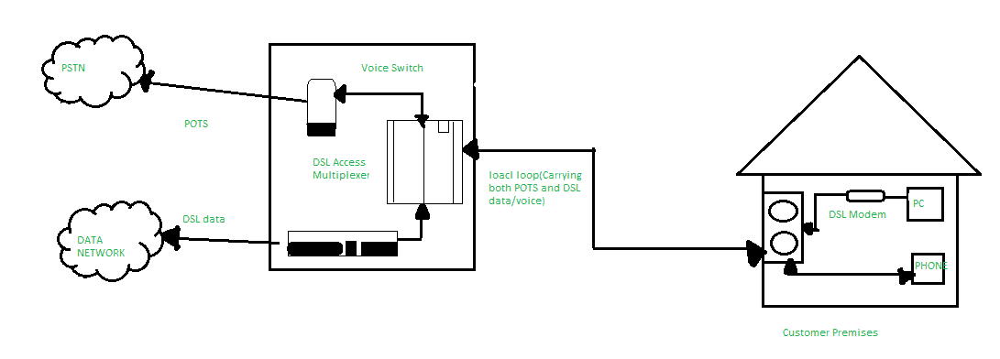

# 数字用户线路(DSL)

> 原文:[https://www.geeksforgeeks.org/digital-subscriber-line-dsl/](https://www.geeksforgeeks.org/digital-subscriber-line-dsl/)

数字用户线路(DSL，*原为*、**数字用户环路**)是一种通信媒介，用于通过铜线电信线路传输互联网。除了有线互联网，DSL 是最流行的方式之一*互联网服务提供商*提供宽带互联网接入。

*   其目的是保持互联网的高速传输。
*   如果我们问如何实现这一目标，即电话和互联网设施，那么答案是使用*分离器或 DSL 过滤器*(如下图所示)。基本上，使用*分离器*是为了分离频率，并确保它们不会被中断。

**DSL 的类型–**

1.  **对称 DSL–**SDSL、*平均分配*上行和下行频率，为上传和下载数据传输提供相同的速度。这种连接可以为上游和下游提供 *2 兆位/秒*，主要是小型组织的首选。
2.  **非对称 DSL–**ADSL，为下行传输提供了更宽的频率范围，提供了数倍的下行速度。ADSL 连接可能提供 *20 Mbps 下行和 1.5 Mbps 上行*，这是因为大多数用户下载的数据比上传的多。

**福利–**

*   **无额外布线–**DSL 连接利用您现有的电话布线，因此您不必为电话系统的昂贵升级付费。
*   **经济高效–**DSL 互联网是一种非常经济高效的方法，在连接性方面表现最好
*   服务提供商提供 DSL 调制解调器。
*   用户可以同时使用电话线和互联网。这是因为声音在其他频率上传输，数字信号在其他频率上传输。
*   用户可以从不同的提供商选择不同的连接速度和 T2 定价。

DSL 互联网服务只能在有限的物理距离上工作，并且在本地电话基础设施不支持 DSL 技术的许多地区仍然不可用。这项服务并不是到处都有。与通过互联网发送数据相比，连接接收数据的速度更快。