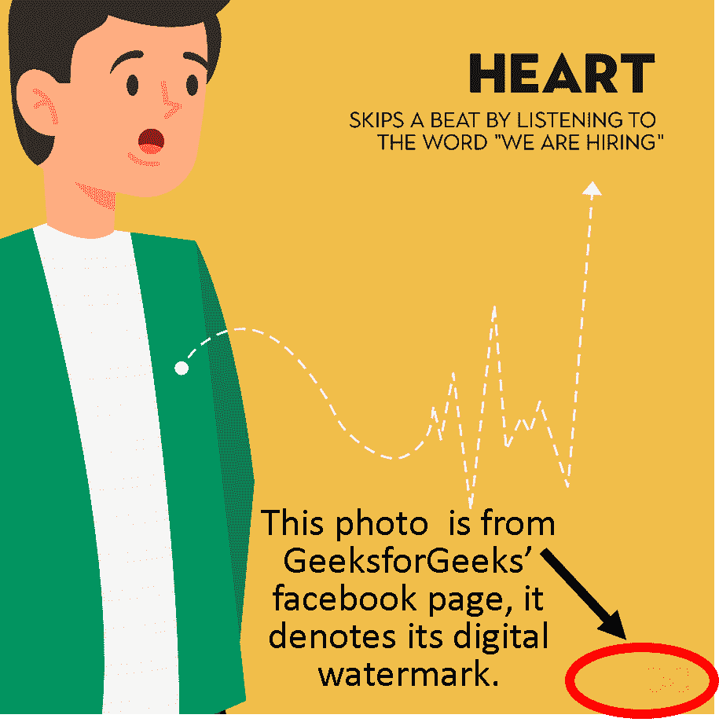

# 数字水印及其类型

> 原文:[https://www . geesforgeks . org/数字水印及其类型/](https://www.geeksforgeeks.org/digital-watermarking-and-its-types/)

**数字水印**是一种嵌入在数字媒体(如音频、视频或图像)中的标记的使用，它使我们能够知道版权的来源或所有者。这种技术用于追踪社交媒体中的版权侵权，并了解银行系统中纸币的真实性。

**水印类型:**

1.  **Visible Watermarks –**
    These watermarks are visible.

    

2.  **不可见水印–**
    这些水印嵌入在媒体中，并使用隐写技术。肉眼看不到它们。
3.  **公共水印–**
    任何使用特定算法的人都可以理解和修改这些水印。这些不安全。
4.  **脆弱水印–**
    这些水印被数据操纵破坏。如果要使用脆弱水印，必须有一个系统能够检测数据中的所有变化。

**数字水印流程(生命周期):**
信息需要嵌入媒体。嵌入的信号是宿主信号，这种信息称为数字水印。该过程有 3 个主要部分:

1.  **嵌入–**
    在这部分，数字信号中嵌入了数字水印。
2.  **攻击–**
    传输媒体发生变化的瞬间，就变成了威胁，被称为对水印系统的攻击。
3.  **保护–**
    从可能改变媒体的噪声信号(JPEG 压缩、旋转、裁剪和添加噪声)中检测水印称为保护。

**应用:**

*   水印用于取证。篡改证据在取证中是不可接受的，水印图像也是可以接受的。
*   这是品牌使用的。数字水印的完成使得数字媒体的权威是完整的。
*   数字水印防止复制数据。
*   视频编辑软件使用水印，以便人们购买完整版本。
*   它用于视频认证。新闻频道经常播放带有水印的其他机构的视频。也用于身份证安全。
*   它用于社交媒体中的内容管理。

**优势:**

*   它用于检测侵犯数字内容版权的行为。
*   水印是一种非常安全的技术。水印的嵌入是通过密钥完成的。任何想要移除水印的人都只能在知道嵌入所涉及的密钥的情况下才能这样做。
*   文件的嵌入版本本质上也是数字的，可以很容易地传输和使用。文件格式不变可确保使用水印媒体时没有错误或困难。

**缺点:**

*   可见的水印很容易被其他水印移除或覆盖。
*   仍然需要发明更健壮的技术来给图片加水印。带有水印的图片很容易调整大小，水印可以裁剪。
*   所有者可以轻松去除水印。这意味着，如果所有者一方的任何人可以轻松地操纵图像并更改水印。