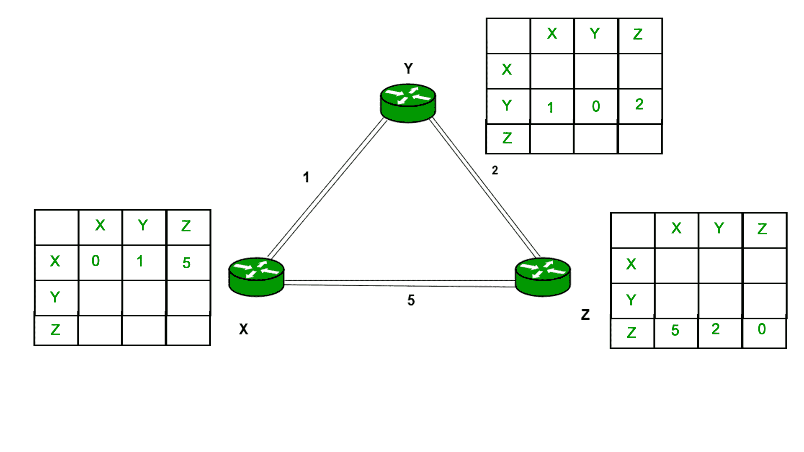
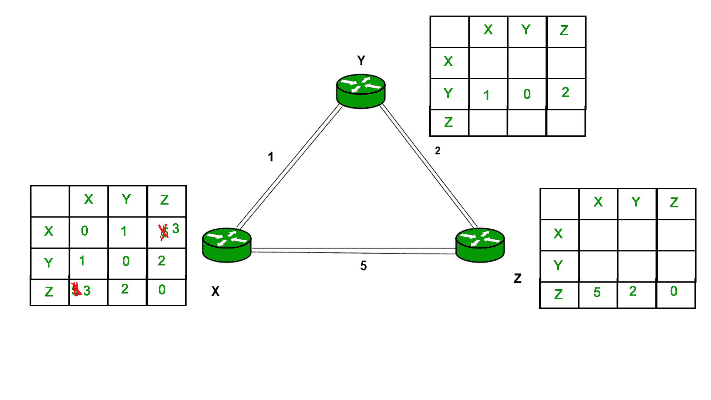
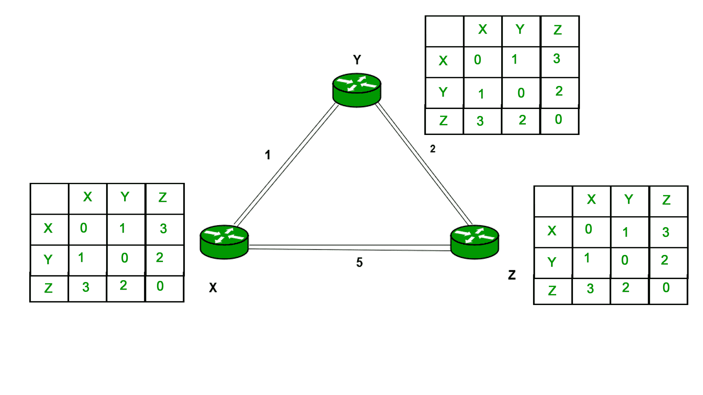

# 距离矢量路由协议

> 原文:[https://www . geesforgeks . org/distance-vector-routing-DVR-protocol/](https://www.geeksforgeeks.org/distance-vector-routing-dvr-protocol/)

距离矢量路由协议要求路由器定期通知其邻居拓扑变化。历史上称为老的 ARPANET 路由算法(或称为 Bellman-Ford 算法)。

**贝尔曼福特基础知识–**每台路由器都维护一个距离向量表，其中包含自身与所有可能的目的节点之间的距离。基于所选度量的距离是使用来自邻居的距离向量的信息来计算的。

```
Information kept by DV router -

```

*   每台路由器都有一个标识
*   与连接到路由器的每条链路相关联的是链路成本(静态或动态)。
*   中间啤酒花

Distance Vector Table Initialization -

*   到自身的距离= 0
*   到所有其他路由器的距离=无穷大。

**距离矢量算法–**

1.  路由器在路由数据包中将它的距离矢量发送给它的每个邻居。
2.  每台路由器接收并保存最近从每个邻居接收到的距离矢量。
3.  当出现以下情况时，路由器会重新计算其距离矢量:
    *   它从邻居那里接收到一个距离矢量，其中包含与以前不同的信息。
    *   它发现与邻居的链接已经断开。

DV 计算是基于最小化每个目的地的成本

```
Dx(y) = Estimate of least cost from x to y 
C(x,v) =  Node x knows cost to each neighbor v
Dx   =  [Dx(y): y ∈ N ] = Node x maintains distance vector
Node x also maintains its neighbors' distance vectors
– For each neighbor v, x maintains Dv = [Dv(y): y ∈ N ]

```

**注–**

*   每个节点不时向邻居发送自己的距离矢量估计值。
*   当节点 x 从任何邻居 v 接收到新的 DV 估计时，它保存 v 的距离向量，并使用 B-F 方程更新它自己的 DV:

    ```
    Dx(y) = min { C(x,v) + Dv(y), Dx(y) } for each node y ∈ N

    ```

**示例–**考虑 3 路由器 X、Y 和 Z，如图所示。每台路由器都有自己的路由表。每个路由表都会包含到目的节点的距离。

以路由器 X 为例，X 会将它的路由表分享给邻居，邻居也会将它的路由表分享给它到 X，而从节点 X 到目的地的距离将使用 bellmen- ford 方程计算。

```
 Dx(y) = min { C(x,v) + Dv(y)} for each node y ∈ N

```

我们可以看到，当 Y 是中间节点(跳)时，从 X 到 Z 的距离会更短，因此它将在路由表 X 中更新。

同样，Z 也是–


最后路由表全部为–


**距离矢量路由的优势–**

*   It is simpler to configure and maintain than link state routing.

    **距离矢量路由的缺点–**

    *   收敛速度比链路状态慢。
    *   它面临着从计数到无穷大的问题。
    *   它产生的流量比链路状态多，因为跳数变化必须传播到所有路由器并在每台路由器上处理。即使网络拓扑没有变化，跳数也会定期更新，因此浪费带宽的广播仍然会发生。
    *   对于较大的网络，距离矢量路由会产生比链路状态更大的路由表，因为每台路由器都必须了解所有其他路由器。这也会导致广域网链路拥塞。

    **注意–**距离矢量路由使用 UDP(用户数据报协议)进行传输。

    **GATE CS 角题**

    练习下列问题将帮助你测试你的知识。所有的问题在前几年的 GATE 考试或 GATE 模拟考试中都被问过。强烈建议你练习一下。

    1.  [GATE CS 2011，问题 52](https://www.geeksforgeeks.org/gate-gate-cs-2011-question-52/)
    2.  [GATE CS 2011，问题 53](https://www.geeksforgeeks.org/gate-gate-cs-2011-question-53/)
    3.  [GATE CS 2010，第 54 题](https://www.geeksforgeeks.org/gate-gate-cs-2010-question-54/)
    4.  [GATE CS 2010，第 55 题](https://www.geeksforgeeks.org/gate-gate-cs-2010-question-55/)
    5.  [GATE IT 2005，问题 28](https://www.geeksforgeeks.org/gate-gate-it-2005-question-28/)
    6.  [GATE CS 2014(第 1 集)，第 33 题](https://www.geeksforgeeks.org/gate-gate-cs-2014-set-1-question-33/)
    7.  [GATE IT 2008，问题 65](https://www.geeksforgeeks.org/gate-gate-it-2008-question-65/)
    8.  [GATE CS 2014(第 2 集)，第 65 题](https://www.geeksforgeeks.org/gate-gate-cs-2014-set-2-question-33/)

    **参考文献–**

    [距离矢量路由–维基百科](https://en.wikipedia.org/wiki/Distance-vector_routing_protocol)

    本文由**阿卡什·莎兰**供稿。如果你喜欢 GeeksforGeeks 并想投稿，你也可以使用[contribute.geeksforgeeks.org](http://www.contribute.geeksforgeeks.org)写一篇文章或者把你的文章邮寄到 contribute@geeksforgeeks.org。看到你的文章出现在极客博客主页上，帮助其他极客。

    如果你发现任何不正确的地方，或者你想分享更多关于上面讨论的话题的信息，请写评论。