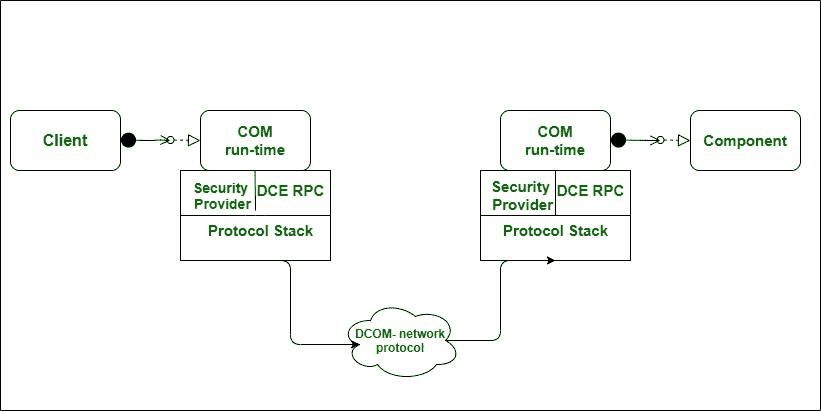

# 分布式组件对象模型(DCOM)

> 原文:[https://www . geesforgeks . org/distributed-component-object-model-DCOM/](https://www.geeksforgeeks.org/distributed-component-object-model-dcom/)

在过去的二十年里，在面向对象和分布式面向组件的范例中发生了大量的修改。为了满足这一需求，微软开发了分布式组件对象模型。DCOM 可以定义为包含一条长线的组件对象模型，这是对[组件对象模型的扩展。DCOM-分布式组件对象模型](https://www.geeksforgeeks.org/difference-between-com-and-dcom/)–通过运行一个称为的协议来帮助远程对象。

对象远程过程调用(ORPC)。每天有 1000 万人在网络环境中使用 Windows DCOM 被广泛使用 DCOM 的主要目的是支持可动态激活的组件的开发，这些组件可以相互协作。DCOM 对象模型基于接口的实现。

(DCOM)对象和组件范例都包含许多问题。

```
1. Interoperability
2. Versioning
3. Language independence
4. Size and complexity of system 
```

**动态数据交换:**
动态数据交换或 DDE，过去是为 Microsoft Windows 设计的，使应用程序能够交换任何特定类型的信息。由于动态数据交换协议实际上有点复杂，并且这种复杂性过去由许多软件程序供应商解释，因此创建了动态数据交换管理库(DDEML)。该库简化了与动态数据交换协议的接口，并为所有开发人员提供了频繁的接口。

**DCOM 架构:**
DCOM 架构是为了提升软件互操作性而设计的。

*   该体系结构支持一种“软件总线”，在这种总线上，可重用的软件程序组件可以无缝地相互使用和内置。
*   为了支持这种可重用的软件组件，完整的对象模型完全基于基于对象的编程模型。
*   过去选择对象模型是因为它不能提供继承。
*   这意味着架构成功地避免了存在于不同模型中的脆弱基类综合症。
*   当一个类继承任何其他类的成员和行为时，脆弱基类综合症就出现了。
*   提供行为和成员函数的类被认为是基类，而其他类被认为是派生类。
*   如果基类的成员和功能被修改，那么派生类的行为和成员函数也会发生变化。
*   像这样的改变最终导致必须改变基类，这又需要编译所有依赖类。
*   图 1.0 所示的 DCOM 体系结构拥有特殊的基础设施，因为它有助于连续存储。



**DCOM 的工作:**
对于 DCOM 的工作，COM 对象希望在两个计算机系统上都得到有效的配置，您几乎不必多次卸载和重新安装对象，就可以让它们在特定任务中有效地工作。Windows 注册表由三个标识符中的 DCOM 配置信息组成，即 CLSID、PROGID 和 APPID。

1.  **CLSID–**
    类标识符或 CLSID 是一个全局唯一标识符或 GUID，用于为实体创建唯一标识。Windows 为执行特定任务的程序中的每个安装类存储这个 CLSID。当你想运行一个类时，你需要正确的 CLSID，这样 Windows 就知道去哪里和定位程序。
2.  **PROGID–**
    编程标识符或 PROGID 是非强制性的，或者你可以说是一个可选的标识符，程序员可以用它来替代任何复杂而严格的 CLSID。程序一般不太复杂，容易理解。有多少程序可以有相同的名字没有限制，这有时会引发问题。
3.  **APPID–**
    应用程序标识符或 APPID 是每个可用应用程序的一种唯一标识符，也称为 App id，有助于 ps 保护和验证您的应用程序。它标识了所有属于相同可执行文件的类，以及进入该文件所需的权限。如果 APPID 不正确，DCOM 就不能工作，也就是说，要让 DCOM 完美地工作，你需要有一个正确的 APPID。根据我的经验，在尝试创建远程对象时，可能会出现权限错误。