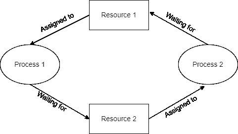
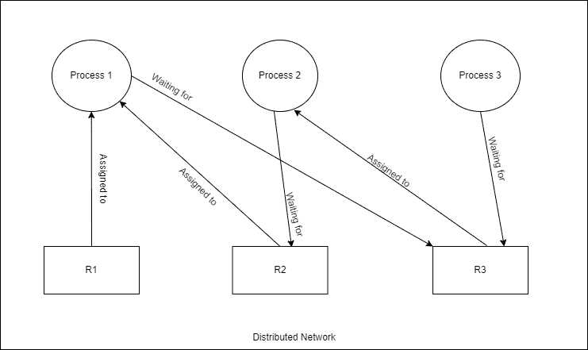
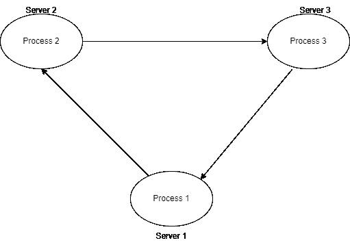

# 分布式系统–分布式死锁的类型

> 原文:[https://www . geesforgeks . org/distributed-system-type-of-distributed-deadlock/](https://www.geeksforgeeks.org/distributed-system-types-of-distributed-deadlock/)

死锁是一组进程被阻塞的情况，因为每个进程都持有一个资源，并等待其他进程占用另一个资源。当这种情况出现时，称为死锁。

僵局

一个[分布式系统](https://www.geeksforgeeks.org/comparison-centralized-decentralized-and-distributed-systems/)是一个机器网络，可以通过消息传递相互交换信息。它非常有用，因为它有助于资源共享。在这种环境中，如果进程的资源分配顺序不受控制，可能会出现死锁。原则上，分布式系统中的死锁类似于集中式系统中的死锁。因此，上面给出的死锁描述对集中式和分布式系统都适用。然而，分布式系统中死锁的处理比集中式系统更复杂，因为资源、进程和其他相关信息分散在系统的不同节点上。

**处理死锁常用的三种策略如下:**

*   **回避:**谨慎分配资源，避免死锁。
*   **预防:**为了防止死锁，对进程请求资源的方式进行约束。
*   **检测和恢复:**允许出现死锁，并使用检测算法进行检测。检测到死锁后，通过某种方式解决。

### **分布式死锁的类型:**

分布式系统中有两种类型的死锁:

**资源死锁:**当两个或多个进程永久等待对方持有的资源时，就会发生资源死锁。

*   一个过程，它的执行需要一定的资源，并且在获得所有这些资源之前不能继续进行。
*   只有当它获得所有需要的资源时，它才会继续执行。
*   也可以使用**和**条件来表示，因为进程只有在拥有所有所需资源的情况下才会执行。
*   示例:流程 1 有 R1、R2 和请求资源 R3。如果其中任何一个丢失，它将不会执行。只有当它获得所有请求的资源(即 R1、R2 和 R3)时，它才会继续。

图 1:资源死锁

**通信死锁:**另一方面，当一组进程被阻塞，等待来自该组中其他进程的消息以便开始执行，但它们之间没有正在传输的消息时，就会发生通信死锁。当集合中的任何一对进程之间没有消息传输时，这些进程都不会收到消息。这意味着集合中的所有进程都是死锁的。通过使用 wfg 来指示哪些进程正在等待从哪些其他进程接收消息，可以很容易地对通信死锁进行建模。因此，通信死锁的检测可以以与每个资源类型只有一个单元的系统相同的方式完成。

*   在通信模型中，一个进程需要资源来执行它，当它获得了至少一个它所请求的资源时，它就继续进行。
*   在这里，资源代表一个可以交流的过程。
*   这里，一个进程等待与一组进程中的另一个进程通信。在集合中的每个进程都在等待与另一个进程通信的情况下，另一个进程本身也在等待与其他进程通信，这种情况称为通信死锁。
*   对于要通信的两个进程，每个进程都应该处于未阻塞状态。
*   它可以用**或**条件来表示，因为它需要至少一个资源来继续它的过程。
*   示例:在分布式系统网络中，进程 1 试图与进程 2 通信，进程 2 试图与进程 3 通信，进程 3 试图与进程 1 通信。在这种情况下，所有进程都不会被解除阻塞，并且会发生通信死锁。

图 2:通信死锁