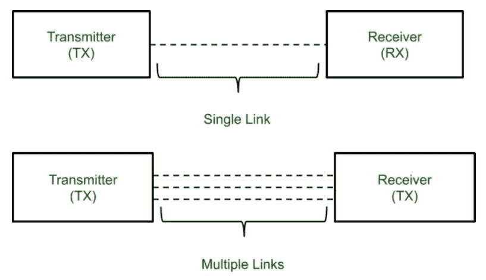

# 多样性及其类型

> 原文:[https://www.geeksforgeeks.org/diversity-and-its-types/](https://www.geeksforgeeks.org/diversity-and-its-types/)

多个信号在接收机处的叠加导致随机幅度变化，这就是所谓的衰落。一种用于减少衰落影响的分集机制被称为分集。在分集机制中，相同数据的多个副本通过多条路径或信道传输到接收机，并且由接收机在发射机不知道的情况下做出决定。

**多样性类型:**

1.  **空间分集:**
    相同信号的复制品通过不同的天线发射。相邻天线之间应留有空间，以便信道增益与信号路径无关。空间分集可以提供一条避免阴影并减少大规模衰落的路径。空间分集提供不同路径，而不增加发射机功率或带宽。
2.  **时间分集:**
    时间分集是通过在不同的时间间隔重新发送相同的信号而获得的。重传间隔应该小于相干时间。时间分集也不需要增加传输功率。
3.  **频率分集:**
    频率分集是通过在一个以上的载频上发送相同的信息或者在不同的载频上发送相同的信号来获得的。在频率分集中，只需要一根天线。
4.  **极化分集:**
    极化分集需要两个不同极化的发射机和两个接收天线。具有两种不同偏振的透射波构成两种不同的路径。这仅提供了两个不同多样性分支。极化分集通过在两个不同的极化天线之间分配功率来使用一半功率。