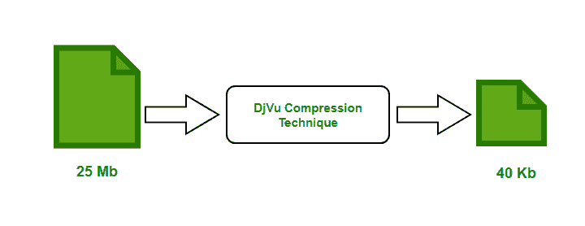

# 计算机网络中的 DjVu 压缩

> 原文:[https://www . geesforgeks . org/djvu-计算机网络压缩/](https://www.geeksforgeeks.org/djvu-compression-in-computer-network/)

大多数图像压缩技术通常与图像类型相关联。对在公共领域共享高分辨率文档感兴趣的企业或个人需要能够提供高压缩率的有效有损压缩技术。通常这类文档在网络浏览器中查看。为了支持在网络浏览器中显示如此高分辨率的文档，所使用的压缩技术应该具有快速解码速率。 **DjVu** 是这种压缩要求的一个选项。

为了在网络浏览器中读取 **DjVu 文件**，解码器以插件的形式实现，该插件可与所有可用的标准网络浏览器一起压缩。在这个解码器的帮助下，缩放和平移带有图像的文件非常容易。用户可以非常快地看到文件的初始版本，并且当更多比特到达时，文件的质量逐渐提高，因此，DjVu 压缩技术被认为本质上是渐进的。

**DjVu 技术**利用了这样一个事实，即扫描文件的各种元素，如文本、图像和绘图，具有不同的感知特征。数字化文本和线条图可以高空间分辨率和低颜色分辨率进行编码，而图像和背景需要高颜色分辨率和低空间分辨率。文本通常需要一种颜色，但图像和绘图需要多种颜色。

**DjVu 压缩率:**
DjVu 提供高达 1000 的压缩系数。与现有的类似压缩技术相比，这种压缩级别高出 5 到 10 倍。例如，以 300 dpi 扫描的全色页面可以从 25 Mb 压缩到 30-60Kb，而不会影响质量。使用 DjVu 方法压缩图像和文本的彩色文档与相似质量的 JPEG 文件相比大多小 5 到 10 倍，使用 DjVu 方法压缩的黑白文档与 [JPEG](https://www.geeksforgeeks.org/process-of-jpeg-data-compression/) 文件相比大多小 10 到 20 倍，与 [GIF](https://www.geeksforgeeks.org/compression-of-gif-images/) 文件相比小 5 倍。同样，使用 DjVu 技术压缩的文件比 PDF 文件小 5 倍左右。

**DjVu 组件:**
在 DjVu 压缩技术中，文档被分解成三个组件，它们是蒙版、前景和背景。代表图像和纸张背景的像素被归类为背景成分。双层形式的文本和线条被视为蒙版组件。这三个分量由解码器解码。之后，背景和前景成分的分辨率被提高回 300 dpi，这将基于遮罩生成最终的解压缩图像像素。掩模像素值 0 意味着从背景解码相应的图像像素。类似地，掩码像素值 1 意味着相应的图像像素是以前景像素的颜色创建的。