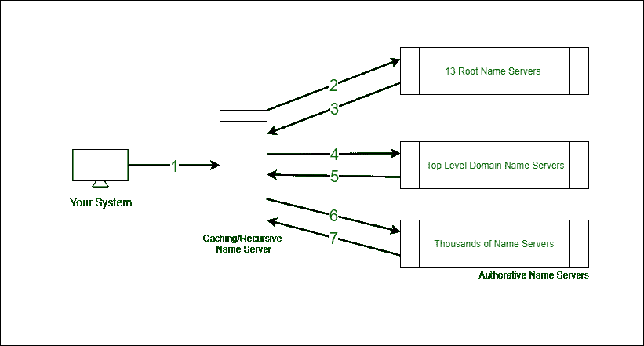

# 域名系统查询

> 原文:[https://www.geeksforgeeks.org/dns-look-up/](https://www.geeksforgeeks.org/dns-look-up/)

先决条件–[域名系统(DNS)](https://www.geeksforgeeks.org/domain-name-system-dns-in-application-layer/)

**需要 DNS :**
有 2 个 <sup>32 个</sup> IP 地址(约 4，294，967，296)。随着互联网的快速发展，出现了记住网站的 IP 地址的问题(如果超人或机器人假装是人类，这就不是问题了)。此问题已使用域名系统解决。域名系统是一种将人类可理解的网址解析成各自 IP 地址的方法。当您在浏览器中输入网址(该网址被称为 FQDN-完全限定域名)时，域名系统会查看与网站相关的实际 IP 地址。

**域名查询:**
为了解决此类域名查询，世界各地都有域名服务器接受您的**域名查询请求**并予以解决。名称服务器有 5 种类型–

1.  缓存名称服务器。
2.  递归名称服务器。
3.  根名称服务器。
4.  顶级域名(TLD)服务器。
5.  作者姓名服务器。

缓存和递归名称服务器通常由互联网服务提供商提供。缓存名称服务器的目的是在一定时间内存储已知域名(类似于数据存储中的缓存)。递归名称服务器执行全名解析。全球有 13 个根名称服务器，负责将请求定向到适当的 TLD 服务器。



<center>**Figure –** DNS Look-up</center>

*   当您在浏览器中键入 FQDN 时，它会检查系统中已经存在的**主机文件**。主机文件包含如下条目–

```
<IP-Address> <Domain-name>
```

**示例–**

```
127.0.0.1 localhost
216.58.203.36 www.google.com
```

*   如果在主机文件中找不到该 IP 地址，则进行 DNS 查找到**缓存名称服务器**，该服务器存储一定时间的域名。
*   如果缓存名称服务器不解析查找，则传输到**递归名称服务器**。递归名称服务器负责执行完整的域名解析请求。
*   来自递归名称服务器的请求使用任播传输到 13 个**根名称服务器**(这是一种根据位置、链路健康和拥塞等因素将流量路由到不同目的地的技术)。
*   根名称服务器用应该查询的 **TLD 名称服务器**的名称响应域名系统查询。
*   对于域名中的每个顶级域名(顶级域名是位于点之后的域名的一部分，例如 com、org 或 net)，都有**顶级域名(TLD)名称服务器**。TLD 服务器响应域名系统查询与重定向，通知您的系统关于哪个作者名称服务器联系。
*   最后，域名系统查询被重定向到**原创名称服务器**以解析网站名称，并提供服务器的实际 IP 地址。

这种严格的层次结构通过以正确的方式解析每个查找来维护互联网的稳定性。这可以防止恶意重定向流量。如今，设备内置了本地缓存服务器，以防止为每个新的 TCP 连接执行 DNS 查找。