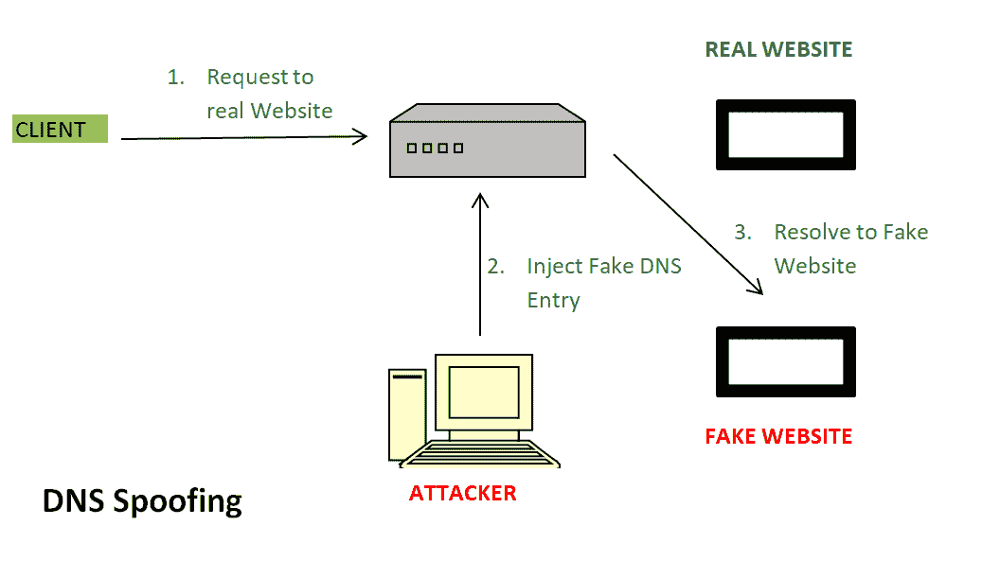

# 域名系统欺骗或域名系统缓存中毒

> 原文:[https://www . geesforgeks . org/DNS-欺骗-或-DNS-缓存中毒/](https://www.geeksforgeeks.org/dns-spoofing-or-dns-cache-poisoning/)

先决条件–[域名服务器](https://www.geeksforgeeks.org/dns-domain-name-server/)
在讨论 DNS 欺骗之前，首先讨论一下什么是 DNS。

**域名系统(DNS)** 将人类可读的名称(如 www.geeksforgeeks.org)转换为数字 IP 地址。DNS 系统对一个或多个 IP 地址的响应，您的计算机通过使用其中一个 IP 地址连接到网站(如 geeksforgeeks.org)。

并不是只有一个 DNS 服务器。有一系列用于解析域名的 DNS 服务器。域名系统使用缓存来高效地工作，这样它就可以快速引用已经执行的域名系统查找，而不是一遍又一遍地执行域名系统查找。
虽然 DNS 缓存提高了域名解析过程的速度但是域名的重大变化需要一天的时间才能在全球范围内反映出来。

**DNS 欺骗**是指从 DNS 服务器获取被请求站点的错误条目或 IP 地址。攻击者发现域名系统中的缺陷并控制，并将重定向到恶意网站。

**上图–**

1.  对真实网站的请求:用户点击一个特定网站的请求，它会转到域名系统服务器来解析该网站的 IP 地址。
2.  注入虚假域名系统条目:黑客已经通过检测缺陷控制了域名系统服务器，现在他们向域名系统服务器添加虚假条目。
3.  解决假冒网站:因为域名系统服务器中的假冒条目将用户重定向到错误的网站。

**防止 DNS 欺骗–**
DNS 安全扩展(DNSSEC)用于在 DNS 解析过程中添加额外的安全层，以防止 DNS 欺骗或 DNS 缓存中毒等安全威胁。
DNSSEC 通过对数据进行数字“签名”来防范此类攻击，因此您可以确信它是有效的。