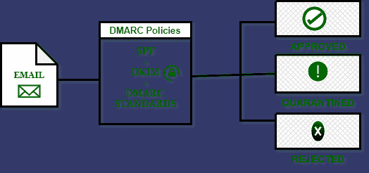

# 基于域的消息认证、报告和一致性(DMARC)

> 原文:[https://www . geesforgeks . org/基于域-消息-身份验证-报告-和一致性-dmarc/](https://www.geeksforgeeks.org/domain-based-message-authentication-reporting-and-conformance-dmarc/)

**“@”:**
的孕育期在 20 世纪 70 年代，人们对威胁和恶意活动并没有更多的认识。网络安全，以前被称为计算机安全，正在逐步发展。甚至在那之前，电子邮件就相当于在某人的电脑上贴便条。因为，谁会不相信同事的任何消息呢？直到画面中出现“@”-apt。

**怎么会出现“@”:**

*   1971 年，雷·汤姆林森向世界介绍了“@”这个贴切的符号。它连接了用户-用户。它更像是用虚拟信封包裹的传统信件，写给个人。电子邮件在增长的同时，恶意邮件、网络钓鱼和垃圾邮件攻击也在增长。
*   它成为最大的信息技术安全威胁，不仅每年给公司造成百万美元的损失，还降低了公司和客户之间的信任。因此，需要某种指导方针来阻止所有这些不必要的活动。为验证发送方和接收方的身份而创建的协议。

**衍生 SPF 和 DKIM，形成一个稳健的 DMARC 标准:**

*   DMARC 标准于 2012 年 1 月 30 日发布。它由已经存在的标准和广泛部署的 SPF(发送者策略框架)和 DKIM(域密钥识别邮件)支持。
*   引入 DMARC 背后的共同目标是开发一个由大型财团支持的标准。当检测到欺诈或任何恶意行为时，DMARC 会根据域的所有者策略采取额外的措施来隔离和拒绝通信。
*   它知道领域所有者，他们进一步传达给客户，所以不应该有任何误解的空间，即兴公司-客户关系。

**DMARC 的需求:**

*   DMARC 用于对抗特定形式的精确域欺骗，尽管 DMARC 的机制用于创建可靠的消息流。
*   这是一种可扩展的机制，保留了当前广泛部署的 SMTP 邮件基础架构的积极方面。
*   DMARC 的采用大幅增加，对电子邮件的送达能力产生了积极和消极的影响。根据学术研究，尽管 DMARC 不是默认的记录类型标准，但 80%的邮箱是用 DMARC 保护的。
*   在一个假设的情况下，如果你受到了恶意的意图；但是如果您以良好的方式实施了 DMARC 策略，网络罪犯将倾向于放弃入侵该域。因为，闯入 DMARC 的机会微乎其微！

**工作细节:**

1.  希望部署 DMARC 的域所有者必须已经在其消息传递基础架构上部署了 [SPF](https://en.wikipedia.org/wiki/Sender_Policy_Framework) 和 [DKIM](https://en.wikipedia.org/wiki/DomainKeys_Identified_Mail) 。
2.  为了成功发布 DMARC 记录，已经发布 SPF 和 DKIM 记录非常重要。一旦这些记录到位，就可以配置 DMARC 记录。可以使用外部指南/向导来创建 SPF 和 DKIM 记录。为了通过 DMARC 身份验证，消息必须通过并对齐 SPF 或 DKIM。
3.  当消息对齐时，接收者知道谁真正发送了消息。DMARC 策略由域所有者发布，并由邮件收件人应用。DMARC 策略作为 TXT 记录发布。如果消息未通过 DMARC 身份验证，接收组织应该遵守您在 DMARC 策略中发布的“处置”。
4.  这是您的 DMARC 记录中的 p=值，如下所示。

*   **P = none–**
    告诉收件人不要对不合格邮件采取行动，但仍向 DMARC 记录中的 mailto:发送电子邮件报告，以了解任何违规情况。
*   **P =隔离–**
    告诉收件人隔离不合格邮件，一般意思是“直接把这个发到垃圾邮件文件夹里。”
*   **P =被拒绝–**
    告诉接收者，无论谁没有通过 DMARC 检查，都要直接拒绝/丢弃该消息。



**DMARC 工作流程**

**描述:**
DMARC 记录看起来如下。

```
v=DMARC1; p=reject; pct=100; rua=mailto:postmaster@dmarcdomain.com" 
```

哪里，

*   **v =DMARC1-**
    它是一个协议版本。这是接收服务器在扫描接收消息的域的 DNS 记录时查找的标识符。如果域没有以 DMARC1 开头的 txt 记录，接收服务器将不会运行 DMARC 检查。
*   **p = reject–**
    您在 DMARC 记录中选择的策略将告诉参与的收件人电子邮件服务器如何处理未通过 SPF 和 DKIM 但声称来自您的域的邮件。
*   **Pct = 100–**
    它给出了要过滤的消息的百分比(Pct)。
*   **rua = mailto:post master–**
    这部分告诉接收服务器在哪里发送 DMARC 故障的聚合报告。确保包含正确的电子邮件地址以接收每日报告。

**结论:**

*   非常重要的是要注意，DMARC 不是默认标准，建议用于业务域，尤其是如果您以前遇到过欺骗。
*   DMARC 是电子邮件认证的一个重要演进。它帮助电子邮件发送者和接收者一起工作，以更好地保护电子邮件，保护用户和品牌免受任何类型的恶意活动。
*   最后但并非最不重要的是，保护你的品牌/公司，不要留下任何子域来利用或冒充，就此而言。