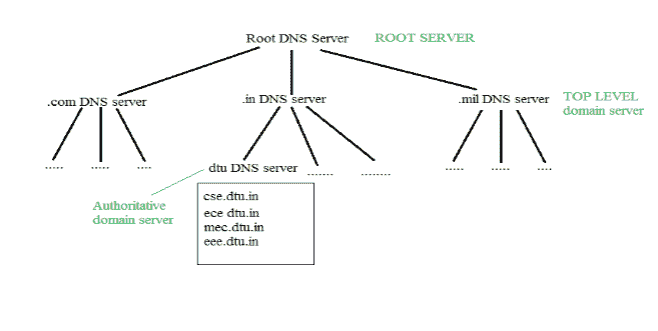
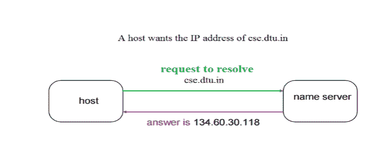
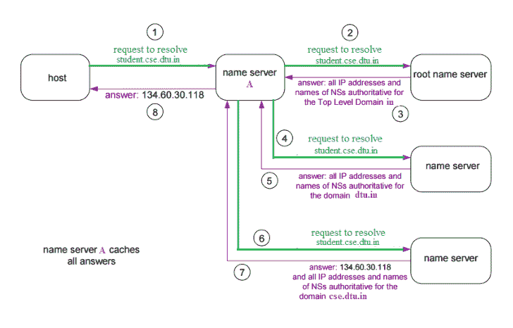

# 应用层域名系统

> 原文:[https://www . geesforgeks . org/域名-系统-dns-in-application-layer/](https://www.geeksforgeeks.org/domain-name-system-dns-in-application-layer/)

DNS 是一种主机名到 IP 地址的转换服务。DNS 是一个分布式数据库，在名称服务器的层次结构中实现。它是客户端和服务器之间消息交换的应用层协议。

**要求**

每个主机都由 IP 地址标识，但是记住数字对人们来说非常困难，而且 IP 地址不是静态的，因此需要一个映射来将域名更改为 IP 地址。因此，域名系统被用来将网站的域名转换成它们的数字 IP 地址。

**Domain :**
有各种各样的 Domain:

1.  通用域:。com(商业)。edu(教育)。军事。组织(非营利组织)。net(类似于商业)所有这些都是通用域。
2.  国家/地区。在(印度)。我们。英国
3.  反向域名如果我们想知道网站的域名是什么。Ip 到域名的映射。因此，域名系统可以提供这两种映射，例如找到 geeksforgeeks.org 的 ip 地址，然后我们必须键入 nslookup www.geeksforgeeks.org。

**域的组织**
 
很难找出与一个网站相关联的 ip 地址，因为有数百万个网站，有了这些网站，我们应该能够立即生成 ip 地址，
不应该有很多延迟，对于这种情况的发生，数据库的组织非常重要。
**DNS 记录**–域名、ip 地址的有效性如何？？活着的时间是什么时候？？以及与该域名相关的所有信息。这些记录存储在树状结构中。

**命名空间**–一组可能的名称，平面的或分层的。命名系统维护一组名称到值的绑定——给定一个名称，解析机制返回相应的值——

**名称服务器**–是解析机制的实现..域名系统=互联网中的名称服务–区域是一个管理单元，域是一个子树。

**名称到地址解析**
 
主机请求 DNS 名称服务器解析域名。名称服务器将对应于该域名的 IP 地址返回给主机，以便主机将来可以连接到该 IP 地址。

**名称服务器的层次结构**
**根名称服务器**–由无法解析名称的名称服务器联系。如果名称映射未知，它将联系权威名称服务器。然后，它获取映射并将 IP 地址返回给主机。

**顶级服务器**–负责 com、org、edu 等以及英国、fr、ca、in 等所有顶级国家域名。他们有关于权威域名服务器的信息，并且知道第二级域名的每个权威域名服务器的名称和 IP 地址。

**权威名称服务器**这是组织的 DNS 服务器，为组织服务器提供权威主机名到 IP 的映射。它可以由组织或服务提供商维护。为了到达 cse.dtu.in，我们必须询问根 DNS 服务器，然后它将指向顶级域服务器，然后指向实际包含 IP 地址的权威域名服务器。因此权威域服务器将返回关联的 ip 地址。

**域名服务器**

 
客户端机器向本地名称服务器发送请求，如果 root 在其数据库中找不到地址，则向 root 名称服务器发送请求，根名称服务器又将查询路由到中间或权威名称服务器。根名称服务器也可以包含一些主机名到 IP 地址的映射。中间名称服务器总是知道谁是权威名称服务器。最后，该 IP 地址被返回给本地名称服务器，该服务器又将该 IP 地址返回给主机。

本文由**莫尼卡·辛格**供稿