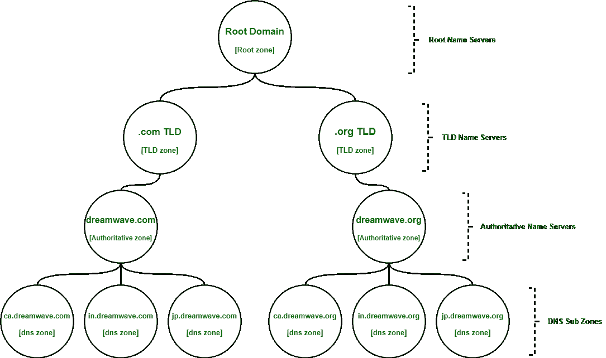

# 域名系统(DNS)区域

> 原文:[https://www.geeksforgeeks.org/domain-name-system-dns-zones/](https://www.geeksforgeeks.org/domain-name-system-dns-zones/)

[域名系统(DNS)](https://www.geeksforgeeks.org/domain-name-system-dns-in-application-layer/) 分为很多多个不同的区域。这些区域区分了域名系统命名空间内特定管理的区域。

**域名系统(DNS)区域**是域名系统(DNS)中域名空间的任何不同的、连接的部分，其管理责任被委托给单个管理空间，从而允许对 DNS 组件进行更平滑的控制。web 的命名空间被组织成 DNS 根域下子域的分层布局。该树的各个域可以作为管理权限和管理的授权点。

*   域名系统区域是分层的概念。因此，为此，命名空间被细分为区域(区域)。域名系统区域的目的是允许更容易地控制多个级别的网站。
*   随着单个域的资源记录数量的增加，管理所有资源记录变得复杂。网络管理部门通过将其配置分成多个区域来缓解这一问题。
*   根名称服务器负责根区域。每个 TLD 域名服务器负责覆盖其特定 TLD 的区域，而权威域名服务器负责其下的一些更小的区域。
*   根名称服务器和 TLD 名称服务器实际上只是权威名称服务器，但是，它们的权威区域是特殊情况。
*   域名系统区域不一定在物理上彼此分开；区域严格用于委派控制。

**示例–**
想象一下，一家名为“Dreamwave”的大型科技公司拥有域名“www.dreamwave”，另外还有 2 台 TLD 服务器:www.dreamwave.com 和 www.dreamwave.org。这家公司在加拿大、印度和日本都有办事处。假设每个办公室大约有 1000 人，他们都有自己独特命名的台式电脑。这将是两者的 3000 个“A 记录”。com，。org TLD，并跟踪它是否全部配置为单个区域。相反，企业可以做的是将每个办公室分成自己的区域。

现在，我们可以将 ca.largecompany.com、in.largecompany.com 和 jp.largecompany.com 作为子域，每个子域都有自己的域名系统区域。现在总共需要四个权威名称服务器进行设置，一个用于 dreamwave.com，一个用于每个子域，同样，总共需要四个权威名称服务器用于 dreamwave.org。

**Figure –** zone hierarchy of “Dreamwave” along with DNS nameservers

**区域文件:**
区域通过所谓的区域文件进行配置，区域文件包含区域的实际表示，简单的配置文件，声明特定区域的所有资源记录。区域文件需要包含 SOA 或授权开始资源记录声明和全局生存时间(TTL)。这个 SOA 记录声明了区域，并因此声明了对其具有权威性的名称服务器的名称。全局生存时间(TTL)，说明记录应该如何保存在本地域名系统缓存中。除了 SOA 记录和 TTL 之外，您通常还会发现指示其他名称服务器的 NS 记录，这些服务器甚至会负责这个区域。区域文件的格式在 RFC 1035 和 1034 中定义。

DNS 区域文件由指令和资源记录组成。

指令以$开头。有三个指令:

*   **$ TTL–**区域的生存时间值。
*   **$ ORIGIN–**定义域名替换中使用的基本名称
*   **$ INCLUDE–**包含文件

在 SOA 记录之前，$TTL 指令必须出现在区域文件的顶部。在讨论区域文件时，了解反向查找区域是非常必要的。

**反向查找区域:**
反向查找区域包含从 IP 地址到主机的映射(与大多数 DNS 区域的功能相反)。这些区域用于故障排除、垃圾邮件过滤和机器人检测。

就像子域可以深入很多层一样，区域通常被构造成也有很多层，有点像子域，尽管很少看到某些区域比几层更深。