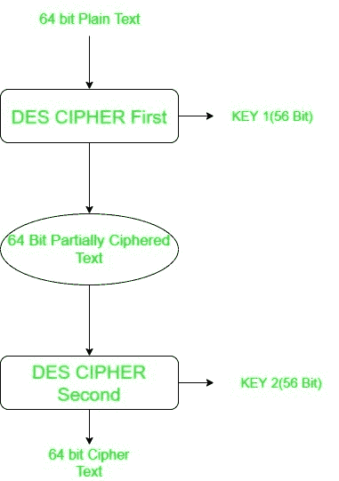
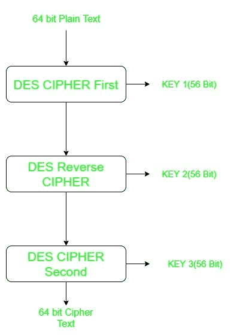

# 双 DES 和三 DES

> 原文:[https://www.geeksforgeeks.org/double-des-and-triple-des/](https://www.geeksforgeeks.org/double-des-and-triple-des/)

众所周知[数据加密标准(DES)](https://www.geeksforgeeks.org/data-encryption-standard-des-set-1/) 使用 56 位密钥对任何可以使用现代技术轻易破解的明文进行加密。为了防止这种情况发生，引入了双重 DES 和三重 DES，它们比原始 DES 安全得多，因为它们分别使用 112 位和 168 位密钥。它们比 DES 提供了更多的安全性。

**双 DES:**
双 DES 是一种在同一纯文本上使用两个 DES 实例的加密技术。在这两种情况下，它使用不同的密钥来加密纯文本。解密时需要两个密钥。64 位纯文本进入第一个 DES 实例，然后使用第一个密钥转换成 64 位中间文本，然后进入第二个 DES 实例，使用第二个密钥给出 64 位密文。

然而，双 DES 使用 112 位密钥，但给出了 2^56 而不是 2^112 的安全级别，这是因为中间相遇攻击可以用来突破双 DES。

**三重 DES:**
三重 DES 是一种加密技术，在同一纯文本上使用三个 DES 实例。它使用不同类型的键选择技术，首先所有使用的键都不同，其次两个键相同，一个不同，第三个键相同。

三重 DES 也容易受到中间人攻击，因为它给出了 2^112 的总体安全级别，而不是使用 168 位密钥。块冲突攻击也可以这样做，因为块大小短，并且使用相同的密钥来加密大大小的文本。它也容易受到 sweet32 攻击。