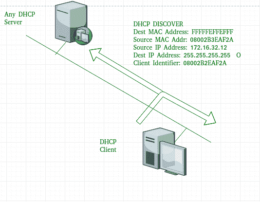
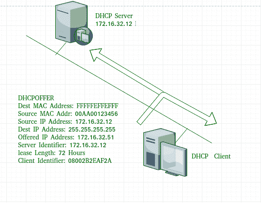
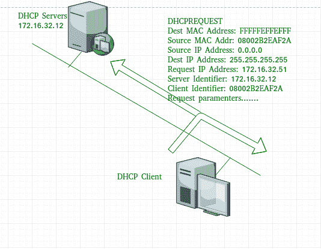
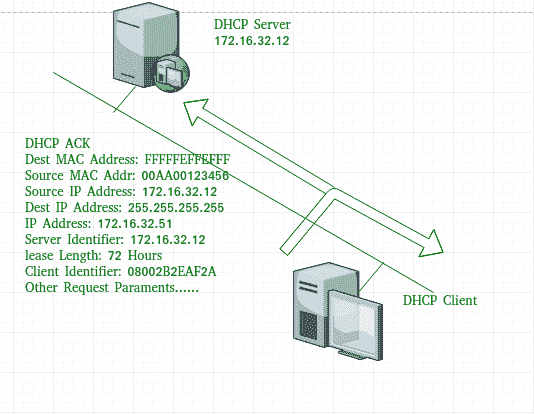

# 动态主机配置协议(DHCP)

> 原文:[https://www . geesforgeks . org/dynamic-host-configuration-protocol-DHCP/](https://www.geeksforgeeks.org/dynamic-host-configuration-protocol-dhcp/)

先决条件–[应用层协议](https://www.geeksforgeeks.org/protocols-application-layer/)
**动态主机配置协议(DHCP)** 是一种应用层协议，用于提供:

1.  子网掩码(选项 1–例如 255.255.255.0)
2.  路由器地址(选项 3–例如 192.168.1.1)
3.  域名系统地址(选项 6–例如，8.8.8.8)
4.  供应商类别标识符(选项 43–例如，“unifi”= 192 . 168 . 1 . 9 # #其中 unifi =控制器)

DHCP 基于客户机-服务器模型，并基于发现、提供、请求和确认。

服务器的 DHCP **端口号**为 67，客户端为 68。这是一个使用 UDP 服务的客户端服务器协议。IP 地址是从地址池中分配的。在 DHCP 中，客户端和服务器主要交换 4 条 DHCP 消息以建立连接，也称为 DORA 过程，但过程中有 8 条 DHCP 消息。

这些信息如下所示:

1.  **DHCP discover message –**
    This is a first message generated in the communication process between server and client. This message is generated by Client host in order to discover if there is any DHCP server/servers are present in a network or not. This message is broadcasted to all devices present in a network to find the DHCP server. This message is 342 or 576 bytes long

    

    如图所示，源 MAC 地址(客户端 PC)为 08002B2EAF2A，目的 MAC 地址(服务器)为 FFFFFFFFFFFF，源 IP 地址为 0.0.0.0(因为 PC 到现在还没有 IP 地址)，目的 IP 地址为 255 . 255 . 255 . 255 . 255(用于广播的 IP 地址)。由于发现消息被广播以找出网络中的一个或多个 DHCP 服务器，因此使用广播 IP 地址和 MAC 地址。

2.  **DHCP offer message –**
    The server will respond to host in this message specifying the unleased IP address and other TCP configuration information. This message is broadcasted by server. Size of message is 342 bytes. If there are more than one DHCP servers present in the network then client host will accept the first DHCP OFFER message it receives. Also a server ID is specified in the packet in order to identify the server.

    

    现在，对于 offer 消息，源 IP 地址为 172.16.32.12(示例中的服务器 IP 地址)，目的 IP 地址为 255.255.255.255(广播 IP 地址)，源 MAC 地址为 00AA00123456，目的 MAC 地址为 ffffffffffffffff。这里，要约消息由 DHCP 服务器广播，因此目的地 IP 地址是广播 IP 地址，目的地 MAC 地址是 FFFFFFFFFFFF，并且源 IP 地址是服务器 IP 地址，而 MAC 地址是服务器 MAC 地址。

    此外，服务器还提供了提供的 IP 地址 192.16.32.51 和 72 小时的租赁时间(此后，主机条目将自动从服务器中删除)。客户端标识符也是所有消息的个人电脑媒体访问控制地址(08002B2EAF2A)。

3.  **DHCP request message –**
    When a client receives a offer message, it responds by broadcasting a DHCP request message. The client will produce a gratitutous ARP in order to find if there is any other host present in the network with same IP address. If there is no reply by other host, then there is no host with same TCP configuration in the network and the message is broadcasted to server showing the acceptance of IP address .A Client ID is also added in this message.

    

    现在，请求消息由客户端 PC 广播，因此源 IP 地址为 0.0.0.0(因为客户端现在没有 IP)，目的 IP 地址为 255.255.255.255(广播 IP 地址)，源 MAC 地址为 08002B2EAF2A (PC MAC 地址)，目的 MAC 地址为 ffffffffffffff。

    **注意–**此消息在电脑广播 ARP 请求后广播，以查明是否有任何其他主机没有使用该提供的 IP。如果没有回复，则客户端主机向服务器广播 DHCP 请求消息，显示接受 IP 地址和其他 TCP/IP 配置。

4.  **DHCP acknowledgement message –**
    In response to the request message received, the server will make an entry with specified client ID and bind the IP address offered with lease time. Now, the client will have the IP address provided by server.

    

    现在，服务器将输入提供的 IP 地址和租用时间。服务器不会将此 IP 地址提供给任何其他主机。目的 MAC 地址为 FFFFFFFFFFFF，目的 IP 地址为 255.255.255.255，源 IP 地址为 172.16.32.12，源 MAC 地址为 00AA00123456(服务器 MAC 地址)。

5.  **DHCP 否定确认消息–**
    每当 DHCP 服务器收到根据配置的作用域无效的 IP 地址请求时，它都会向客户端发送 DHCP Nak 消息。例如，当服务器没有未使用的 IP 地址或池为空时，服务器会将此消息发送给客户端。
6.  **DHCP 拒绝–**
    如果 DHCP 客户端确定提供的配置参数不同或无效，它会向服务器发送 DHCP 拒绝消息。当客户端收到任何主机对免费 ARP 的回复时，客户端会向服务器发送 DHCP 拒绝消息，显示所提供的 IP 地址已被使用。
7.  **DHCP 释放–**
    DHCP 客户端向服务器发送 DHCP 释放包，释放 IP 地址并取消任何剩余的租用时间。
8.  **DHCP 通知–**
    如果客户端地址手动获取了 IP 地址，则客户端使用 DHCP 通知来获取其他本地配置参数，如域名。响应于 dhcp 通知消息，DHCP 服务器生成具有适合客户端的本地配置的 DHCP ack 消息，而不分配新的 IP 地址。该 DHCP 确认消息被单播到客户端。

**注意–**如果服务器位于不同的网络中，所有消息也可以由 dhcp 中继代理单播。

**优势–**使用 DHCP 的优势包括:

*   IP 地址的集中管理
*   向网络添加新客户端的便利性
*   IP 地址的重用减少了所需的 IP 地址总数
*   简单地重新配置 DHCP 服务器上的 IP 地址空间，无需重新配置每个客户端

DHCP 协议为网络管理员提供了一种从集中区域配置网络的方法。
在 DHCP 的帮助下，可以实现新用户的轻松处理和 IP 地址的重用。

**缺点–**使用 DHCP 的缺点是:

*   可能会发生知识产权冲突

**参考资料–**
[DHCP–help . ubnt](https://help.ubnt.com/hc/en-us/articles/115005987748-Intro-to-Networking-Dynamic-Host-Configuration-Protocol-DHCP-)
[DHCP–docs . Oracle](https://docs.oracle.com/cd/E37670_01/E41138/html/ol_about_netaddr.html)