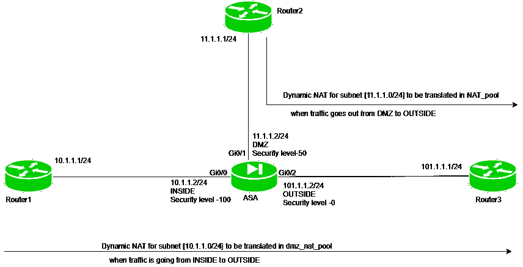

# 动态 NAT(在 ASA 上)

> 原文:[https://www.geeksforgeeks.org/dynamic-nat-on-asa/](https://www.geeksforgeeks.org/dynamic-nat-on-asa/)

先决条件–[自适应安全设备(ASA)](https://www.geeksforgeeks.org/computer-network-adaptive-security-appliance-asa-features/) 、[网络地址转换(NAT)](https://www.geeksforgeeks.org/computer-network-network-address-translation-nat/) 、[静态 NAT(在 ASA 上)](https://www.geeksforgeeks.org/computer-network-static-nat-on-asa/)
网络地址转换用于在访问互联网时将私有 IP 地址转换为公共 IP 地址。NAT 通常在路由器或防火墙上运行。

**动态 NAT–**
在这种类型的 NAT 中，多个私有 IP 地址被映射到一个公共 IP 地址池。当我们知道在给定时间点想要访问互联网的固定用户数量时，就会用到它。

**示例:**如果池中有 4 个公共 IP 地址，那么一次只有 4 个用户的私有 IP 地址被转换为公共地址。
先有翻译请求的私有 IP 会先被翻译(如先到先得)。如果池中的所有 IP 地址都很忙，并且收到了转换请求，则数据包将被丢弃。

**过程(在 ASA 上)–**过程与静态 NAT 相同:

*   **步骤-1:配置访问列表–**
    构建访问列表，说明许可条件，即应该允许谁以及应该允许什么协议。

*   **步骤 2:将访问列表应用于接口–**
    访问组命令将用于说明动作(如上所述)应该发生的方向(出或入)。

*   **Step-3: Create network object –** 
    This will state the host or subnet on which Dynamic NAT will be applied. 

    **注意**这里创建了两个对象。一个将指定应该应用 NAT 的主机或子网(私有 IP 地址)，另一个将指定公共 IP 地址池。

*   **步骤-4:创建动态 NAT 语句–**
    这一步将指定 NAT 应该发生的方向，以及应该在哪个 IP 地址(公共 IP 地址)上转换私有 IP 地址。

例如，网络地址转换(非军事区，外部)，动态私有主机公共池:这表示当流量从非军事区流向外部时，将进行动态网络地址转换操作，并将 IP 地址(在网络对象私有主机中指定)转换为池(公共池)的可用 IP 地址。

**示例–**



三个路由器，即路由器 1 (IP 地址–10 . 1 . 1 . 1/24)、路由器 2 (IP 地址–11.1.1.1/24)和路由器 3 (IP 地址–101.1.1.1)连接到 ASA (IP 地址- 10.1.1.2/24，名称–内部和安全级别–Gi0/0 上的 100，IP 地址–11.1.1.2/24,名称–非军事区和安全级别–Gi0/1 上的 50，IP 地址–101.1.1.2/24,名称–外部和安全级别–Gi0/2 上的 0)，如上图所示。

在本任务中，我们将为从内部到外部产生的流量以及从非军事区到外部的流量启用动态网络地址转换。
在所有路由器和 ASA 上配置 IP 地址。
在路由器 1 上配置 IP 地址。

```
Router1(config)#int fa0/0
Router1(config-if)#ip address 10.1.1.1 255.255.255.0
Router1(config-if)#no shut 
```

在路由器 2 上配置 IP 地址。

```
Router2(config)#int fa0/0
Router2(config-if)#ip address 11.1.1.1 255.255.255.0
Router2(config-if)#no shut 
```

在路由器 3 上配置 IP 地址。

```
Router3(config)#int fa0/0
Router3(config-if)#ip address 101.1.1.1 255.255.255.0
Router3(config-if)#no shut 
```

在 ASA 的接口上配置 IP 地址、名称和安全级别。

```
asa(config)#int Gi0/0
asa(config-if)#no shut
asa(config-if)#ip address 10.1.1.2 255.255.255.0
asa(config-if)#nameif INSIDE 
asa(config-if)#security level 100
asa(config-if)#exit
asa(config)#int Gi0/1
asa(config-if)#no shut
asa(config-if)#ip address 11.1.1.2 255.255.255.0
asa(config-if)#nameif DMZ
asa(config-if)#security level 50
asa(config-if)#exit
asa(config)#int Gi0/2
asa(config-if)#no shut
asa(config-if)#ip address 101.1.1.2 255.255.255.0
asa(config-if)#nameif OUTSIDE
asa(config-if)#security level 0
```

现在给路由器静态路由。配置到路由器 1 的静态路由。

```
Router1(config)#ip route 0.0.0.0 0.0.0.0 10.1.1.2 
```

配置到路由器 2 的静态路由。

```
Router2(config)#ip route 0.0.0.0 0.0.0.0 11.1.1.2 
```

配置到路由器 3 的静态路由。

```
Router3(config)#ip route 0.0.0.0 0.0.0.0 101.1.1.2 
```

现在，最后，配置到 ASA 的静态路由。

```
asa(config)#route INSIDE 10.1.1.0 255.255.255.0 10.1.1.1
asa(config)#route OUTSIDE 101.1.1.0 255.255.255.0 101.1.1.1
asa(config)#route DMZ 11.1.1.0 255.255.255.0 10.1.1.1
```

现在，对于 ICMP，要么我们必须检查，要么我们必须使用 ACL 来允许 ICMP 回应从较低的安全级别到较高的安全级别(这样做是因为默认情况下，不允许从较低的安全级别到较高的安全级别的流量)。

配置访问列表:

```
asa(config)#access-list traffic_out permit icmp any any 
asa(config)#access-list traffic_dmz permit icmp any any 
```

这里，制作了两个访问列表:

1.  首先，访问列表名是 traffic_out，它将允许从外部到内部的 ICMP 流量(具有任何掩码的 IP 地址)。

2.  第二个访问列表被命名为 traffic_dmz，它将允许 ICMP 流量从外部到 dmz(具有任何掩码的 IP 地址)。

现在，我们必须将此访问列表应用于 ASA 接口:

```
asa(config)#access-group traffic_out in interface OUTSIDE 
asa(config)#access-group traffic_dmz in interface DMZ
```

第一种说法是访问列表流量 _out 在向内的方向上应用于外部接口
第二种说法是访问列表流量 _dmz 在向内的方向上应用于 dmz 接口。
现在，内部设备将能够 ping 通外部和非军事区设备。
现在，任务是每当整个子网(10.1.1.0/24)的流量从内部流出到外部，以及网络(11.1.1.0/24)的流量从非军事区流出到外部时，在 ASA 上启用动态 NAT。

```
asa(config)#object network inside_nat
asa(config-network-object)#subnet 10.1.1.0 255.255.255.0
asa(config-network-object)#exit
```

首先，我们指定了应该转换哪个子网。

```
asa(config)#object network NAT_pool
asa(config-network-object)#range 110.1.1.1 110.1.1.4
asa(config-network-object)#exit
```

现在，NAT 池已经建立，它包含公共 IP 地址(私有 IP 地址被转换成这个地址)。现在，将指定 NAT 转换的方向。

```
asa(config)#nat (INSIDE, OUTSIDE) source dynamic inside_nat NAT_pool
```

现在，为从非军事区到外部的流量应用 NAT。

```
asa(config)#object network dmz_nat
asa(config-network-object)#subnet 11.1.1.0 255.255.255.0
asa(config-network-object)#exit
```

现在，为该流量创建 NAT 池。

```
asa(config)#object network dmz_nat_pool
asa(config-network-object)#range 120.1.1.1 120.1.1.4
asa(config-network-object)#exit
```

池 dmz_nat_pool 包含 4 个公共 IP 地址，范围从(120.1.1.1)到 120.1.1.4。现在，指定了 NAT 转换的方向。

```
asa(config)#nat (DMZ, OUTSIDE) source dynamic dmz_nat dmz_nat_pool 
```

上面的命令指定 dmz_nat 中的子网应该使用动态 nat 转换为池 dmz_nat_pool 的一个 IP 地址。