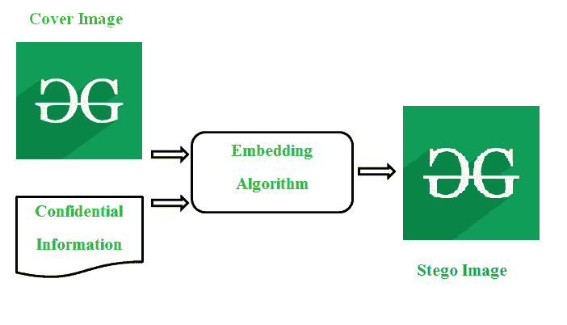

# 隐写术的早期证据

> 原文:[https://www . geesforgeks . org/早期隐写证据/](https://www.geeksforgeeks.org/early-evidence-of-steganography/)

**隐写术**可以称之为一种无形的沟通艺术。它隐藏了交流的存在，没有留下任何明显的证据。换句话说，隐写术是一种隐藏秘密信息的技术，外人甚至无法感知嵌入信息的存在。用于隐藏信息的介质称为封面对象。基于覆盖对象，隐写技术可分为[图像隐写](https://www.geeksforgeeks.org/image-steganography-in-cryptography/)、音频隐写、视频隐写、文本隐写等。在图像隐写的情况下，具有隐藏数据的图像被称为隐写图像。下图显示了一个基本的图像隐写系统。

**隐写术的早期证据:**
尽管“隐写术”一词是在 15 世纪末创造的，但隐写术的历史可以追溯到公元前 440 年。它是由两个希腊词“stegano”和“grafia”组合而成的，这两个词分别表示遮盖/秘密和书写/绘画。在古代，隐藏秘密信息的不同方式是在奴隶的头皮上纹身，藏在涂有蜡的石板上，在兔子的肚子上写字等。。

**奴隶头皮上的纹身:**
希罗多德在公元前 484-425 年间引用了已知最早的隐写术证据。他规定了西提乌斯(他的主人)如何把他的一个奴隶送到米利都的爱奥尼亚城市，并在他的身体上隐藏了一个秘密信息。首先，在奴隶或携带者剃头后，将信息纹在头皮上。奴隶在允许自己的头发生长后，才被送往爱奥尼亚城市米利都。信使到达目的地后，奴隶们的头又被剃了，以便解码秘密信息。希罗多德也记录了德美拉图斯如何将薛西斯入侵希腊的意图告知斯巴达。

**蜡衣片:**
作为隐写术的另一个早期证据，蜡衣片在古希腊被用于书写文字。为了保守信息的秘密，将药片上的蜡涂层去掉，并将信息刻在下面的木头上。写完密信后，碑又被蜡覆盖了。由于没有明显的证据表明平板电脑中存在信息，毫无疑问，它们很容易通过哨兵的检查。嵌入的信息只能通过刮去所有的蜡来解码。

**女子耳环:**
希腊作家埃涅阿斯·战术家提出了另一种隐写术。他的想法是选择女性耳环作为隐藏秘密信息的媒介。他还提出了用鸽子传递秘密信息的想法。

**隐形墨水:**
除了上面提到的方法，另一种用来隐藏信息的古老技术是使用“隐形墨水”。使用隐形墨水隐藏数据可以追溯到公元一世纪。古代，罗马人用隐形墨水在字里行间书写来隐藏秘密信息。在那些日子里，隐形墨水是从尿液、牛奶和果汁等容易获得的物质中提取出来的。通过加热信件，可以加热信件中的秘密信息，从而使文本变暗，秘密信息可以被揭示或解码。另一种用于解码信息的技术是在信中加入少量的炭黑或烟灰，这些炭黑或烟灰会粘在看不见的墨水上。

随着科学的进步，随着化学分支的发展，新技术与隐形墨水方法相结合，以隐藏秘密数据。例如，五倍子制成的没食子酸被用作隐形墨水。隐藏的东西可以通过在上面涂硫酸铜来发现。第二次世界大战期间使用的另一种早期化学方法是在手帕上使用硫酸铜溶液书写秘密信息，并通过暴露在氨气中进行解码。

在十五和十六世纪期间，隐写术技术继续发展，并在二十世纪真正开花结果。