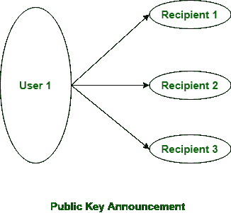

# 密码学中的简单密钥管理

> 原文:[https://www . geesforgeks . org/easy-key-management in cryptography/](https://www.geeksforgeeks.org/easy-key-management-in-cryptography/)

**密钥管理:**
在密码学中，在发送方和接收方之间分发公钥和私钥是一项非常繁琐的任务。如果密钥为第三方(伪造者/窃听者)所知，那么整个安全机制就变得毫无价值。因此，需要确保密钥交换的安全。

密钥管理有两个方面:

1.  公钥的分发。
2.  使用公钥加密来分发秘密。

**公钥的分发:**

公钥可以通过 4 种方式分发:公开声明、公开目录、公钥机构和公钥证书。这些解释如下。

1.  **Public Announcement:**
    Here the public key is broadcasted to everyone. Major weakness of this method is forgery. Anyone can create a key claiming to be someone else and broadcast it. Until forgery is discovered can masquerade as claimed user.

    

2.  **Publicly Available Directory:**
    In this type, the public key is stored at a public directory. Directories are trusted here, with properties like Participant Registration, access and allow to modify values at any time, contains entries like {name, public-key}.

    目录可以通过电子方式访问，但仍然容易被伪造或篡改。

3.  **Public Key Authority:**
    It is similar to the directory but, improve security by tightening control over distribution of keys from directory. It requires users to know public key for the directory. Whenever the keys are needed, a real-time access to directory is made by the user to obtain any desired public key securely.
4.  **公共认证:**
    这一次权威机构提供了一个证书(将身份绑定到公钥)，允许密钥交换，而无需每次实时访问公共机构。证书还附有其他信息，如有效期、使用权等。所有这些内容都由受信任的公钥或证书颁发机构(CA)签名，并且可以由拥有该机构公钥的任何人进行验证。