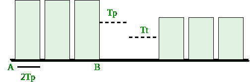

# CSMA/光盘效率

> 原文:[https://www.geeksforgeeks.org/efficiency-of-csma-cd/](https://www.geeksforgeeks.org/efficiency-of-csma-cd/)

**先决条件–**[以太网简介](https://www.geeksforgeeks.org/local-area-network-lan-technologies/)、[CSMA/光盘基础知识](https://www.geeksforgeeks.org/computer-networks-gate-notes-set-1-data-link-layer/)

**带碰撞检测的载波侦听多路访问(CSMA/光盘)–**
CSMA 方法没有告诉我们发生碰撞时该怎么办。带有冲突检测的载波侦听多路访问(CSMA/光盘)增加了 CSMA 算法来处理冲突。在 CSMA/光盘中，帧的大小必须足够大，以便发送方在发送帧时可以检测到冲突。所以，帧传输延迟必须至少是*最大传播延迟的两倍*。

假设某个站点传输了数据包并成功到达目的地，但这只是*最佳情况*，因此我们必须采用*最坏情况*场景，在该场景中会有争用时隙。争用时隙是那些由于冲突而不能传输其行程的时隙。假设甲站传输数据但发生冲突，最糟糕的情况是浪费时间 **2Tp** ，然后某个乙站找到了传输数据的方法，于是就用了(如图)

```
Tp ( propagation delay) + Tt(transmission time)

```

现在我们不知道有多少个争用时隙，所以我们认为最坏的情况是 **n** 个争用时隙。

```
Efficiency = Tt / ( C*2*Tp + Tt + Tp)  
Tt ? transmission time
Tp ? propagation time
C  ? number of collision

```



在 CSMA/光盘中，为了成功，只有一个站点应该传输，而其他站点不应该传输。设 p 为成功传输数据的概率。

```
P(success) = nC1 * p * (1-p)n-1 (by using Binomial distribution)

```

对于最大 P(成功)，求 P 的微分并等于零(得到最大值和最小值)。

```
We get P(max) = 1/e 

```

在获得第一次成功之前，我们需要尝试的次数

```
1/P(MAX) = 1/(1/e) = e

```

这里我们需要尝试的次数(C) = e。

在效率= Tt / (C* 2 * Tp + Tt + Tp)中输入 a = Tt/Tp 并除以 T

我们得到，

```
Efficiency = 1/(e*2a + 1 + a)
a = Tp/Tt
e = 2.72

Now 
Efficiency = 1/( 1 + 6.44a)

```

**效率的进一步分析:**

```
Efficiency = 1/ (1 + 6.44a)

           = 1/ {1 + 6.44(Tp/Tt)}

           = 1/ {1 + 6.44((distance/speed)(Bandwidth/packet length))}

```

从这个推导，我们可以得出很多关系:

*   如果距离增加，CSMA 的效率就会降低。
*   CSMA 不适合像广域网这样的长途网络；但最适合局域网。
*   如果数据包的长度越大，CSMA 的效率也就越高；但是长度的最大限制是 1500 字节。
*   传输时间> = 2 *传播时间

**GATE CS 角题**

练习下列问题将帮助你测试你的知识。所有的问题在前几年的 GATE 考试或 GATE 模拟考试中都被问过。强烈建议你练习一下。

1.  [GATE CS 2003，问题 90](https://www.geeksforgeeks.org/gate-gate-cs-2003-question-83/)
2.  [GATE CS 2015(第三集)，第 65 题](https://www.geeksforgeeks.org/gate-gate-cs-2015-set-3-question-16/)
3.  [GATE IT 2005，问题 27](https://www.geeksforgeeks.org/gate-gate-it-2005-question-27/)
4.  [GATE IT 2005，问题 71](https://www.geeksforgeeks.org/gate-gate-it-2005-question-71/)
5.  [GATE CS 2016(第 2 集)，第 63 题](https://www.geeksforgeeks.org/gate-gate-cs-2016-set-2-question-63/)
6.  [GATE IT 2008，问题 63](https://www.geeksforgeeks.org/gate-gate-it-2008-question-63/)

**参考–**
[https://www.youtube.com/watch?v=74zlRH-bj2c](https://www.youtube.com/watch?v=74zlRH-bj2c)

本文由**阿卡什·莎兰**供稿。如果你喜欢 GeeksforGeeks 并想投稿，你也可以使用[contribute.geeksforgeeks.org](http://www.contribute.geeksforgeeks.org)写一篇文章或者把你的文章邮寄到 contribute@geeksforgeeks.org。看到你的文章出现在极客博客主页上，帮助其他极客。

如果你发现任何不正确的地方，或者你想分享更多关于上面讨论的话题的信息，请写评论。