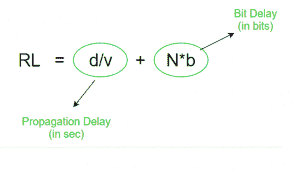

# 令牌环的效率

> 原文:[https://www.geeksforgeeks.org/efficiency-of-token-ring/](https://www.geeksforgeeks.org/efficiency-of-token-ring/)

**令牌环**协议是局域网中使用的一种通信协议。在令牌环协议中，网络拓扑用于定义站点发送的顺序。这些站在一个环中相互连接。它使用一个特殊的三字节帧，称为“T2”令牌“T3”，围绕一个环传输。它利用[令牌传递](https://www.geeksforgeeks.org/computer-network-controlled-access-protocols/)控制访问机制。帧也在令牌的方向上传输。通过这种方式，它们将在环内循环，到达目的地车站。


**环延时–**
单个比特在环上传输所花费的时间称为环延时。



其中，
d =环的长度
v =环中数据的速度
N =环中的站数
b =每个站在传输比特之前保持比特所花费的时间(比特延迟)

**将 N*b 转换为秒–**

```
RL = d/v + (N*b)/B  (B – bandwidth)
```

**将数模转换为位–**

```
RL = (d/v)*B + N*b  (B – bandwidth)
```

**循环时间–**
令牌完成一圈的时间称为循环时间。

```
Cycle time = Tp + (THT*N)
Where, THT - Token Holding Time
Tp - Propagation delay(d/v) 
```

**令牌保持时间(THT)–**
一个站可以保持令牌帧的最长时间称为 THT，默认设置为 10 秒。在 THT 以外，没有一个车站能持有代币。

**计算 THT:**


**1。延迟令牌重新插入(DTR)–**

*   在这种情况下，发送方发送数据包并等待，直到整个数据包完成环的往返并返回。当发送方收到整个数据包时，它会释放令牌
*   在一个实例中，环中只有一个数据包
*   比 ETR 更可靠


在这种情况下，

```
THT = Tt + RL
    = Tt + Tp + N*b   (In most cases, bit delay is 0) 
So, THT = Tt + Tp
 where Tt = transmission delay
       Tp = propagation delay
```

**2。早期代币再插入(ETR)–**

*   发送方在释放令牌之前不会等待数据包完成旋转。数据一传输，令牌就被释放
*   环中存在多个数据包
*   不如 DTR 可靠


**站 1:** 接收令牌并向 D1 传输数据，然后释放令牌。
**站 2:** 接收 D1(放在另一端)和令牌，然后传输数据 D2 并释放令牌。
**站 3:** 接收 D1–>发送 D1
接收 D2–>发送 D2
接收令牌–>发送 D3
释放令牌。
**站 4:** 接收 D1–>发送 D1
接收 D2–>发送 D2
接收 D3–>发送 D3
接收令牌–>发送 D4
释放令牌。

**站 1:** 接收 D1–>丢弃 D1，因为 D1 已经完成其旅程
接收 D2–>发送 D2
接收 D3–>发送 D3
接收 D4–>发送 D4
接收令牌–>发送 D1(新)
释放令牌。
(循环继续如此…..)

在这种情况下，

```
 THT = Tt
 where Tt = transmission delay
       Tp = propagation delay
```

**效率–**
效率，e =有用时间/总时间

有用时间= N*T <sub>t</sub>
总时间=周期时间= T <sub>p</sub> + (THT*N)

所以，e =(N * T<sub>T</sub>)/(T<sub>p</sub>+(THT * N))

**1。延迟令牌重新插入–**
在这种情况下，THT = T<sub>T</sub>+T<sub>p</sub>T7】所以，周期时间= T<sub>p</sub>+N *(T<sub>T</sub>+T<sub>p</sub>)

```
Efficiency, e = (N*T<sub>t)/(Tp + N*(Tt + Tp))</sub>
 <sub>= 1/(1 + a*((N+1)/N))</sub>
<sub>where a = Tp/Tt</sub>
```

**2。早期令牌重新插入–**
在这种情况下，THT = T<sub>T</sub>T5】所以，周期时间= T <sub>p</sub> + N*(T <sub>t</sub> )

```
Efficiency, e = (N*T<sub>t)/(Tp + N*(Tt))</sub>
 <sub>= 1/(1 + a*(1/N))</sub>
<sub>where a = Tp/Tt</sub>
```

**GATE 练习题–**

1.  [GATE-CS-2014-(Set-1) |第 65 题](https://www.geeksforgeeks.org/gate-gate-cs-2014-set-1-question-36/)
2.  [GATE-CS-2014-(Set-2) |第 35 题](https://www.geeksforgeeks.org/gate-gate-cs-2014-set-2-question-35/)
3.  [GATE IT 2007 |问题 72](https://www.geeksforgeeks.org/gate-gate-it-2007-question-72/)
4.  [GATE IT 2007 |问题 73](https://www.geeksforgeeks.org/gate-gate-it-2007-question-73/)
5.  [GATE-IT-2004 |问题 82](https://www.geeksforgeeks.org/gate-gate-it-2004-question-82/)