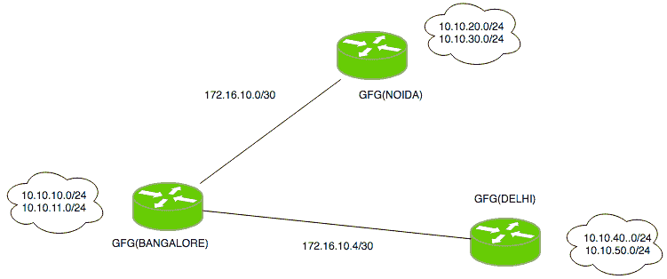
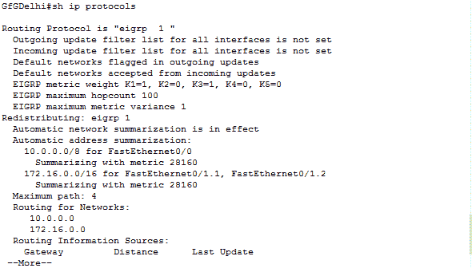
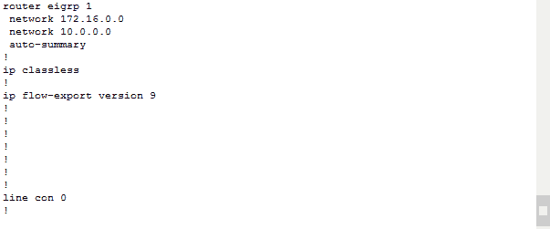
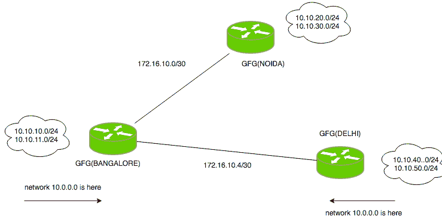
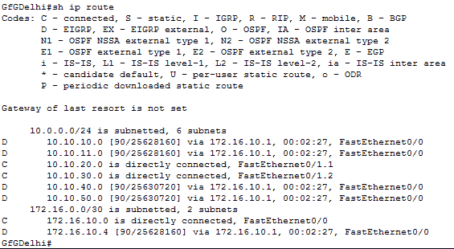

# EIGRP 配置

> 原文:[https://www.geeksforgeeks.org/eigrp-configuration/](https://www.geeksforgeeks.org/eigrp-configuration/)

先决条件–[EIGRP 基础知识](https://www.geeksforgeeks.org/computer-network-eigrp-fundamentals/)
增强型内部网关路由协议(EIGRP)是一种**动态路由网络层协议**，适用于 88 号协议。EIGRP 支持无类路由、VLSM、路由总结、负载平衡和许多其他有用的功能。它是思科专有协议，因此在运行 EIGRP 的网络中，所有路由器都必须是思科路由器，但现在 EIGRP 正朝着成为开放标准协议的方向发展。

EIGRP 在运行 EIGRP 的路由器之间交换消息进行通信。

**配置–**



有一个小拓扑，其中有 3 个路由器(用户将在其上配置 EIGRP)，即 *GfGNoida、GfGDelhi、GfGBangalore* 。如图所示，GfGBangalore 路由器必须通告网络 10.10.10.0/24、10.10.11.0/24、172.16.10.0/30、172.16.10.4/30。

因此，现在为路由器 GfGBangalore 配置 EIGRP。

```
GfGB(config)#router eigrp 1
GfGB(config-router)#network 10.10.10.0
GfGB(config-router)#network 10.10.11.0
GfGB(config-router)#network 172.16.10.0
GfGB(config-router)#network 172.16.10.4 
```

这里，首先通过**路由器 eigrp 1** 命令创建一个 EIGRP 实例，其中 1 是自治系统号。现在，要为 GfGDelhi 路由器配置 EIGRP，需要通告的网络是 10.10.40.0/24、10.10.50.0/24 和 172.16.10.4/30

```
GfGDelhi(config)#router eigrp 1
GfGDelhi(config-router)#network 172.16.10.4 
GfGDelhi(config-router)#network 10.10.50.0
GfGDelhi(config-router)#network 10.10.40.0 
```

现在，类似地为 GfGNoida 配置 EIGRP，要通告的网络是 10.10.20.0/24、10.10.30.0/24、172.16.10.0/30

```
GfGN(config)#router eigrp 1
GfGN(config-router)#network 172.16.10.0
GfGN(config-router)#network 10.10.20.0
GfGN(config-router)#network 10.10.30.0 
```

这是一个简单的配置，其中用户必须使用 network 命令编写要通告的网络的网络标识。

**故障排除–**
按照配置的 EIGRP，用户应该会看到在运行 EIGRP 的路由器之间形成邻居时出现的问题。如果出现以下情况，则不会形成邻居关系:

*   接口被配置为被动的
*   k 值不匹配
*   自治系统编号不同
*   EIGRP 身份验证配置错误
*   设备之间的接口关闭

在这种情况下，如果邻接关系正常，但路由器没有收到网络更新，则可能是以下原因:

*   适当的网络不会被通告
*   ACL 应用于接口
*   自动总结命令会对不需要的网络进行总结

现在，在我们配置的场景中观察所有这些事情，可以看到:

1.  the autonomous system is same on all routers (as configured 1).

    

2.  使用默认的 K 值(10100)，如上图所示。
3.  不应用身份验证。
4.  界面打开了。
5.  此外，没有应用 ACL。

这种情况下出现的问题是网络更新被总结。为什么呢？



因为自动汇总已启用。这是 EIGRP 配置过程中最常见的问题。默认情况下，自动总结命令在 EIGRP 中是启用的，因此在此对路由进行总结。因此，情况如下图所示:



因此，用户必须在所有路由器上禁用自动总结命令。

```
GfGB(config-router)#no auto-summary 
```

同样，在路由器 GfGDelhi 和 GfGN 上，也不会配置自动总结命令。



现在，用户可以看到交换了所有正确的路由(不是总结的路由)。