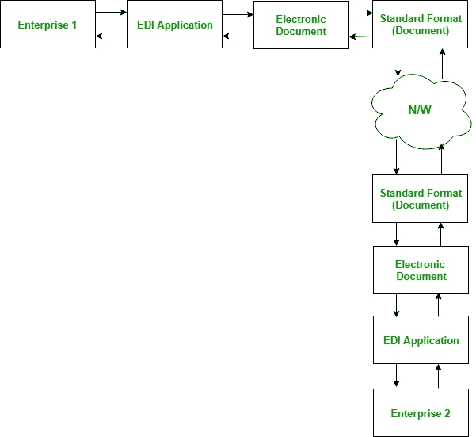

# 电子数据交换

> 原文:[https://www.geeksforgeeks.org/electronic-data-interchange/](https://www.geeksforgeeks.org/electronic-data-interchange/)

**电子数据交换**是商业伙伴或公司之间以标准电子格式进行计算机到计算机的商业文档交换的技术。公司使用电子数据交换系统通过计算机系统自动交换商业信息，作为没有纸张的交易，因此最大限度地减少或完全消除了人为干预。电子数据交换通常用于 B2B 交易。

**常见 EDI 单据:**

1.  运输请求
2.  发票
3.  确认
4.  采购订单

**EDI 系统:**

两家企业的系统中都安装了电子数据交换应用程序。企业 1 使用它的电子数据交换应用程序来生成它想要与其他企业共享的电子数据交换文档。该电子数据交换文件的格式必须是两家企业在交易过程中为共享电子数据交换文件而确定的标准格式。该文档通过网络与其他企业共享。企业 2 在电子数据交换应用程序上以标准格式接收文档。这就是两家企业如何以电子方式交换业务文档，并最大限度地减少或消除人为干预。

**优势:**

*   由于它是直接计算机对计算机的交易系统，所以速度很快。
*   由于减少了人为干预，所以非常准确。
*   简单易用。
*   高度安全。
*   减少纸张工作。
*   性价比高。