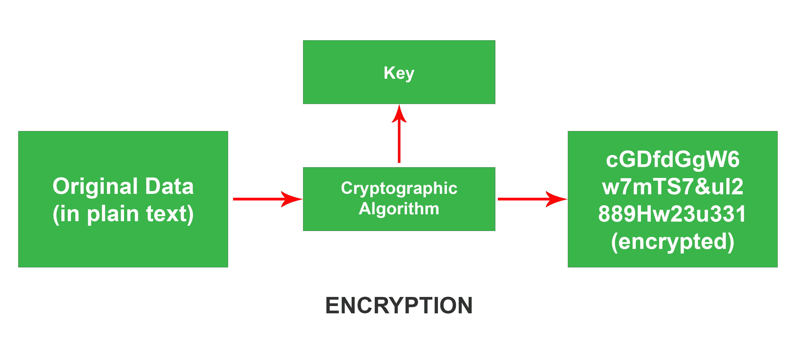
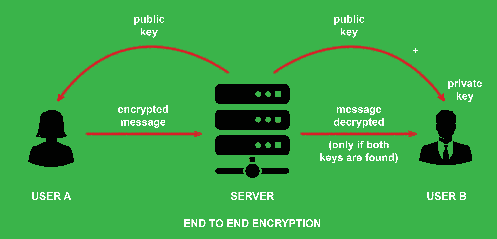

# 计算机网络中的端到端加密(E2EE)

> 原文:[https://www . geesforgeks . org/端到端加密-e2ee-in-computer-networks/](https://www.geeksforgeeks.org/end-to-end-encryption-e2ee-in-computer-networks/)

**什么是加密？**
你有没有想过我们的电子邮件、短信、照片、视频是如何通过互联网发送的？每当你通过互联网发送任何东西时，它都会经过许多服务器、路由器和其他设备，任何人都可以拦截它并访问你的私人信息。因此，为了解决这样的问题，引入了**加密**。在加密中，发送的数据被修改成用户之间无法读取的形式。加密基本上是将数据修改成不可读的形式。当数据到达接收者时，数据再次被修改为其原始形式。这个过程叫做**解密**。需要一个密钥来解密被称为*加密密钥*的加密数据。只有拥有该密钥的一方才能访问数据。

**什么是 E2EE？**
它是一种类型的*非对称*加密。在这种类型的加密中，双方都有两个密钥，公钥和私钥。公钥对每一方和服务器上的任何人都是可用的。私钥只为所有者所知，其他人都不知道，甚至对另一端的一方也不知道。解密加密数据需要公钥和私钥。假设 c 罗在给梅西发短信。公钥对双方和服务器都是已知的。但是他们两个都有私钥，没有人知道。因此，c 罗发送的文本无法被服务器读取(因为它没有私钥)。c 罗*解密原文需要梅西的私钥和公钥(希望上面写着“我们都是传奇！！! ")*。在这种加密中，中间方无论如何都无法访问数据。

所有这些加密、解密、生成密钥等都由网络机制、软件和算法来处理。我们不需要担心端到端加密的实现。坐下来放松一下，因为这是迄今为止最安全的信息发送方式。虽然不能百分之百保证它的脆弱性。也许在不久的将来，会有一些比这更好的加密方法。但 E2EE 是目前最**高效的**加密。