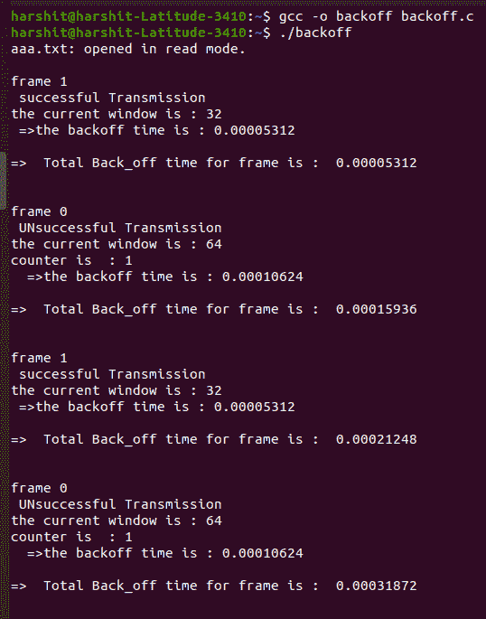
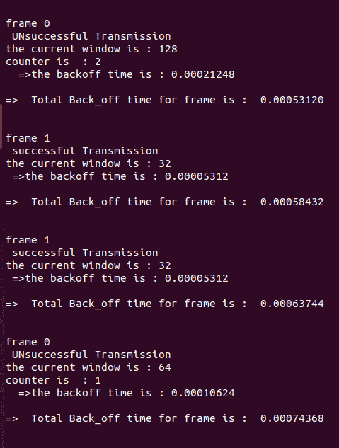
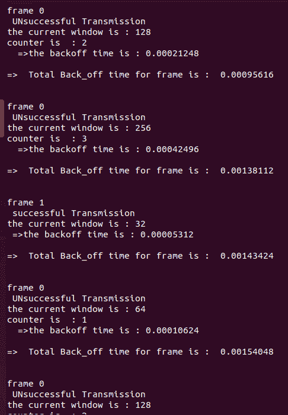
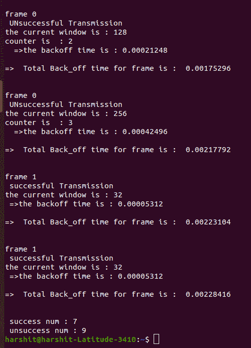
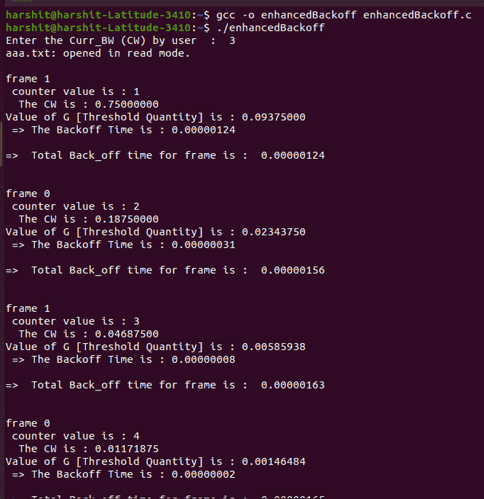
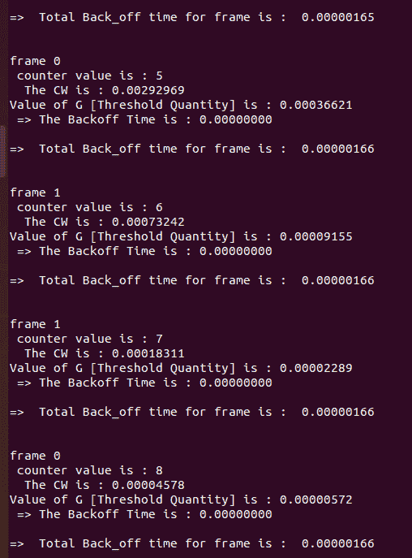
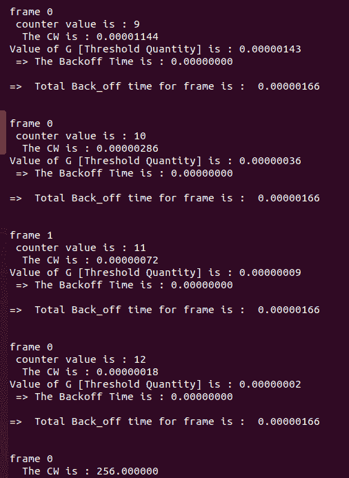
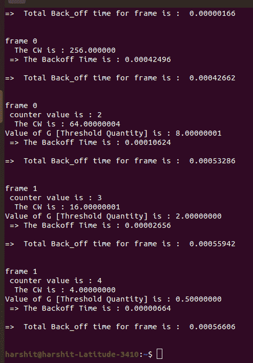

# 自组织网络中用于公平信道接入的增强二进制指数退避算法

> 原文:[https://www . geeksforgeeks . org/增强型-二进制-指数-退避-公平信道接入算法-自组织网络/](https://www.geeksforgeeks.org/enhanced-binary-exponential-backoff-algorithm-for-fair-channel-access-in-ad-hoc-networks/)

二进制指数回退算法通过随机化试图接入无线信道的站点的时刻来防止同时接入期间的分组冲突。但是，这种随机化并不能完全消除数据包冲突，从而导致系统吞吐量降低，数据包延迟和丢弃增加。此外， **BEB 算法**导致站间不公平的信道接入。

移动[自组织网络](https://www.geeksforgeeks.org/introduction-of-mobile-ad-hoc-network-manet/)是一组无线节点，它们可以动态地将自己排列成任意的临时拓扑，而不需要预先存在的基础设施来形成网络。节点在通信时可能会动态移动，使节点无法计算。节点可以轻快地离开[拓扑网络](https://www.geeksforgeeks.org/types-of-network-topology/)。

通常，该网络用于**应急操作**、**环境控制**、**军事应用**等没有**集中网络基础设施管理或支持**的应用，如[路由器](https://www.geeksforgeeks.org/packet-queuing-and-dropping-in-routers/)或**基站**在 [IEEE 802.11](https://www.geeksforgeeks.org/wi-fi-standards-explained/) 标准中，[分布式协调功能(DCF)算法](https://www.geeksforgeeks.org/ieee-802-11-mac-frame/)是一种高效且基本的算法，可确保最佳【T16 基于载波侦听多路访问和冲突避免[(CSMA/加州)协议](https://www.geeksforgeeks.org/carrier-sense-multiple-access-csma/)，DCF 共享介质访问，遵循“先听后说”的基本原则。离散余弦变换采用 **BEB 算法**。**在**冲突之后，希望重传的节点等待一段随机的时间，该时间被称为退避时间。这里，相对于具有较高 BT 的节点，具有较小 BT 的节点将首先访问介质。

**<u>分布式协调功能</u> :**

该功能用于使用[CSMA/加州](https://www.geeksforgeeks.org/carrier-sense-multiple-access-csma/)和 [RTS/CTS](https://www.geeksforgeeks.org/difference-between-rts-cts-and-dtr-dsr-flow-control/) 确认帧来防止碰撞。传输时，发送方等待 **DIFS(分布式协调功能帧间间隔)**时间。如果信道空闲，它发送数据帧，即 RTS 确认帧，同时接收器等待 **SIFS(短帧间间隔)**时间量，然后发送 CTS 帧收据给发送器。如果信道繁忙，该站等待该信道，直到它被感测到空闲了 DIFS 时间。此时，它会生成随机 BT 来发送数据帧。

### **<u>二进制指数退避算法</u> :**

数据传输成功后，调用功能 **CW()** 将 CW 调整为 CWmin。在数据冲突期间，节点调用函数 Double **CW()** 将 CW 加倍，直到它等于或大于 CWmax。

如果节点尝试发送数据七次未成功，也会调用函数 **CW()** 将 CW 调整为 CWmin，因此数据包延迟和丢弃的增加也会降低数据帧重传的概率。同样，公平问题也出现了。

**<u>公平性问题</u> :**

如果假定的**节点 A** 的退避时间与**节点 B** 相比较低，那么**节点 A** 将首先达到零，并将竞争窗口重置为最小值，由于这一点，第一个节点的传输具有一次又一次传输其节点的更高概率。

考虑一个文件**“AAA . txt”**。在该文件中，生成 **0s** 和 **1s** 。这里 **0s** 表示不成功， **1s** 表示成功。以下是文本文件:

> 1010011000100011

下面是上述方法的实现:

## C

```
// C program for the above approach
#include <stdio.h>
#include <stdlib.h>
#include <string.h>
#include <time.h>

// Driver Code
int main()
{
    // Slot time
    float slot_time = 0.00000166;

    int CWmin = 32, CWmax = 1024;

    int k;
    int i, Curr_BW = 32, counter = 0;
    float BT, Total_Backoff_time = 0;

    FILE* fp;
    char* f_name = "aaa.txt";
    char ch;
    int x = 0, y = 0;

    fp = fopen(f_name, "r+");

    // Open File
    if (fp == NULL) {
        printf("%s does not exists"
               " \n",
               f_name);
        return 0;
    }

    // Otherwise
    else {
        printf("%s: opened in read"
               " mode.\n\n",
               f_name);
    }

    // Read characters from the file
    while ((ch = fgetc(fp)) != EOF) {

        // End-of-file is reached
        if (ch == '1' || ch == '0') {
            printf("frame %c \n ", ch);
        }

        // If the character is 1
        if (ch == '1') {

            x = x + 1;
            printf("successful "
                   "Transmission\n");
            Curr_BW = CWmin;
            printf("the current "
                   "window is : %d\n",
                   Curr_BW);

            BT = Curr_BW * slot_time;
            printf(" =>the backoff"
                   " time is : %0.8f"
                   " \n",
                   BT);

            counter = 0;
        }

        // If the character is 0
        else if (ch == '0') {

            y = y + 1;
            if (counter < 7) {

                printf("UNsuccessful "
                       "Transmission\n");

                Curr_BW = Curr_BW * 2;

                if (Curr_BW > CWmax) {

                    Curr_BW = CWmax;
                }
                printf("the current "
                       "window is :"
                       " %d\n",
                       Curr_BW);

                counter = counter + 1;
                printf("counter is  :"
                       " %d \n ",
                       counter);

                BT = Curr_BW * slot_time;

                printf(" =>the backoff"
                       " time is : %0.8f"
                       " \n",
                       BT);
            }

            // Otherwise
            else {

                Curr_BW = CWmin;
                printf("the current"
                       " window is :"
                       " %d\n",
                       Curr_BW);

                BT = Curr_BW * slot_time;
                printf(" =>the backoff"
                       " time is : %0.8f"
                       " \n",
                       BT);
            }
        }

        if (ch == '1' || ch == '0') {

            // Find the Backoff Time
            Total_Backoff_time = Total_Backoff_time + BT;

            printf("\n");

            // Print the time
            printf("=>  Total Back_off"
                   " time for frame is : "
                   " %0.8f \n ",
                   Total_Backoff_time);
            printf("\n\n");
        }
    }

    // Print the success and
    // unsuccess number
    printf(" success num : %d\n", x);
    printf(" unsuccess num : %d\n", y);

    return 0;
}
```

**输入文件:**

```
1010011000100011
```

**输出:**

[](https://media.geeksforgeeks.org/wp-content/cdn-uploads/20210326232034/Code1Image1.png)[](https://media.geeksforgeeks.org/wp-content/cdn-uploads/20210326232030/Code1Image2.png)[](https://media.geeksforgeeks.org/wp-content/cdn-uploads/20210326232028/Code1Image3.png)[](https://media.geeksforgeeks.org/wp-content/cdn-uploads/20210326232024/Code1Image4.png)

**<u>改进的二进制指数退避算法</u> :**

该算法(在本文中也称为 I-BEB 算法)旨在解决节点间的公平性问题，同时与 BEB 算法相比，可以传输到点并降低数据包延迟。

在第 12<sup>次成功传输后，计数器被设置为 **1** ，并且竞争窗口呈指数级增加。尽管如此，我-BEB 并没有解决多少公平问题。在此算法中，使用阈值是因为可能会出现活动站的数量增加并增加冲突机会的情况。当 **CW** 小于阈值时，它将其竞争窗口大小等于阈值，以增加成功传输的概率</sup>

> C = 12，D = 4，E = 8，G = 0.125 * CWmin
> CWmin = 32，CWmax = 1024
> 
> 其中，
> C = >成功发送次数
> D = >快速降低 CW
> E = >线性增加 CW
> G = >阈值数量
> CW = >最小争用窗口大小
> BT = >退避时间

下面是上述方法的实现:

## C

```
// C program for the above approach

#include <stdio.h>
#include <stdlib.h>
#include <string.h>
#include <time.h>

// Driver Code
int main()

{
    int C = 12, D = 4, E = 8;

    int counter = 0;

    // Slot time
    double slot_time = 0.00000166,
           CW;
    int CWmax = 1024, CWmin = 32;
    double BT, G,
        Total_Backoff_time = 0;

    // C => successful sending times
    // D => Quickly decrease the the CW
    // E => linearly inc the CW
    // G => Threshold quantity
    // CW => Minimum Contention Window Size
    // BT => Backoff time

    // Enter the current BW
    printf("Enter the Curr_BW (CW)"
           " by user  :  ");
    scanf("%lf", &CW);

    FILE* fp;
    char* f_name = "aaa.txt";
    char ch;

    // Open the file
    fp = fopen(f_name, "r+");

    // If file doesn't exists
    if (fp == NULL) {
        printf("%s does not exists"
               " \n",
               f_name);
        return 0;
    }

    // Otherwise
    else {
        printf("%s: opened in read"
               " mode.\n\n",
               f_name);
    }

    // Read character by characters
    while ((ch = fgetc(fp)) != EOF) {

        // End-of-file
        if (ch == '0' || ch == '1') {
            printf("frame %c \n ", ch);
        }

        if (ch == '1' || ch == '0') {

            if (counter < C) {

                // Print the counter
                // value
                counter = counter + 1;
                printf("counter value"
                       " is : %d\n ",
                       counter);

                CW = CW / D;
                printf(" The CW is :"
                       " %0.8f\n",
                       CW);

                G = 0.125 * CW;
                printf("Value of G "
                       "[Threshold Quantity]"
                       " is : %0.8f\n",
                       G);

                if (CW < G) {
                    CW = G;
                    BT = CW * slot_time;
                    printf(
                        " => The"
                        " Backoff Time"
                        " is : %0.8f\n",
                        BT);
                }
                else {
                    BT = CW * slot_time;
                    printf(
                        " => The "
                        "Backoff Time"
                        " is : %0.8f\n",
                        BT);
                }
            }
            else {
                counter = 1;
                CW = CW + (E * CWmin);

                printf(" The CW is :"
                       " %lf\n",
                       CW);

                if (CW > CWmax) {
                    CW = CWmax;

                    BT = CW * slot_time;
                    printf(
                        " => The "
                        "Backoff Time"
                        " is : %0.8f\n",
                        BT);
                }
                else {

                    BT = CW * slot_time;
                    printf(
                        " => The "
                        "Backoff Time"
                        " is : %0.8f\n",
                        BT);
                }
            }
        }

        if (ch == '1' || ch == '0') {

            // Find the Backoff time
            Total_Backoff_time = Total_Backoff_time + BT;

            printf("\n");

            // Print the Back Off Time
            printf("=>  Total Back_off"
                   " time for frame is : "
                   " %0.8f \n ",
                   Total_Backoff_time);
            printf("\n\n");
        }
    }
}
```

**输入文件:**

```
1010011000100011
```

**输出:**

 

