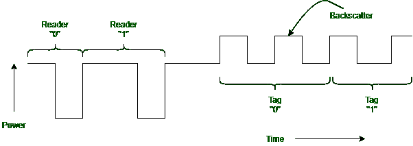

# EPC 第 2 代物理层

> 原文:[https://www.geeksforgeeks.org/epc-gen-2-physical-layer/](https://www.geeksforgeeks.org/epc-gen-2-physical-layer/)

比特在射频识别阅读器和物理层定义的标签之间发送。它用于发送无线信号的许多方法，我们以前见过。在美国，传输是在未经许可的 902-928 兆赫 ISM 频段发送的。这种未经许可的频段属于超高频范围，因此这些标签被称为超高频射频识别标签。至少每 400 毫秒阅读器执行一次跳频。

*   把信号传播到整个频道。
*   限制干扰
*   满足监管要求。

读取器和标签使用调幅编码位。链路是半双工的，因为它们轮流发送比特。
与其他物理层的两个主要区别如下。

1.  Regardless it is the reader or tag that is communicating, the reader is always transmitting a signal. To send bits to tags the reader transmits the signal. The reader transmits a fixed carrier signal that carries no bits, for the tags to send bits to the reader. A tag would not be able to transmit in the first place if the tags do not harvest this signal to get the power they need to run. To send data, a tag changes, whether it is reflecting the signal from the reader, like a reader, like a radar signal bouncing off a target, or absorbing it.

    这种方法叫做**反向散射。**在这种情况下，发送方和接收方永远不会同时发送。对于标签来说，创建一个自己的微弱信号，显示在阅读器上，反向散射是一种低能量的方式。要为阅读器解码输入信号，它必须过滤掉正在传输的输出信号。标签无法接收甚至感应到来自其他标签的传输。标签只能以低速率向读取器发送比特，因为标签信号很弱。

2.  使用非常简单的调制形式，因此它们可以在一个标签上实现，该标签只需要很少的功率，并且制造成本仅为几美分。
    阅读器使用两个振幅级别，向标签发送数据。位被确定为 0 或 1，这取决于读取器在低功率周期之前等待的时间。低功率时段之间的时间由标签测量。标签还会将此时间与前同步码期间测量的参考值进行比较。如图(1)所示，1 比 0 长。

**示例–**
图(1)中的双脉冲周期编码示例。-

图(1)::阅读器和标签反向散射信号。