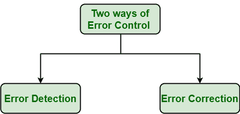
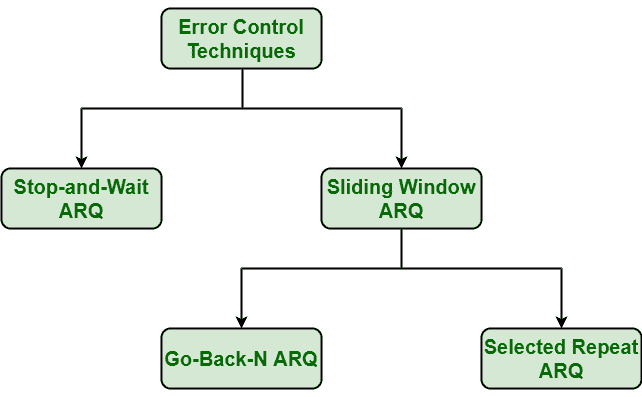

# 数据链路层错误控制

> 原文:[https://www . geesforgeks . org/数据链路层错误控制/](https://www.geeksforgeeks.org/error-control-in-data-link-layer/)

[数据链路层](https://www.geeksforgeeks.org/design-issues-in-data-link-layer/)使用错误控制技术来确保和确认所有数据帧或数据包(即数据比特流)以一定的精度从发送方传输到接收方。在这个数据链路层使用或提供错误控制是一种优化，它从来都不是必需的。差错控制基本上是在数据链路层中检测或识别并重新传输在传输期间可能丢失或损坏的数据帧的过程。

在这两种情况下，接收者或目的地没有接收到正确的数据帧，并且发送者或源甚至不知道任何关于数据帧的这种丢失。因此，在这种类型的情况下，发送方和接收方都被提供了检测或识别这种类型的错误(如数据帧丢失)所需的一些基本协议。

数据链路层采用称为帧重传的技术来检测或识别传输错误，并采取必要的措施来减少或消除此类错误。每次在传输过程中检测到努力，特定的数据帧就会被重新传输，这个过程称为 ARQ(自动重复请求)。

**进行错误控制的方式:**
进行错误控制的方式基本上有两种，如下所示:

错误控制的方法

1.  **错误检测:**
    错误检测，顾名思义，就是检测或识别错误。在通信系统中，这些错误可能是由于从发射机到接收机的传输过程中的噪声或任何其他损伤引起的。这是一类检测乱码的技术，即不清楚和失真的数据或信息。
2.  **纠错:**
    纠错，顾名思义，就是纠正或解决或修正错误。它仅仅意味着重建和恢复没有错误的原始数据。但是纠错方法非常昂贵，而且非常困难。

**各种差错控制技术:**
差错控制技术如下:

误差控制技术

**1。[停候 ARQ](https://www.geeksforgeeks.org/stop-and-wait-arq/) :**
停候 ARQ 又称交替位协议。这是最简单的流程和错误控制技术或机制之一。电信中通常需要这种机制来在两个连接的设备之间传输数据或信息。接收器只是表示它准备好接收每一帧的数据。在这种情况下，发送者向接收者发送信息或数据包。然后发送方停止并等待接收方的确认。此外，如果确认没有在给定的时间周期内到达，即超时，发送方然后再次重新发送帧并等待确认。但是，如果发送方收到确认，它会将下一个数据包发送给接收方，然后再次等待接收方的确认。停止并等待的过程一直持续到发送方没有数据帧或数据包要发送。

**2。[滑动窗口 ARQ](https://www.geeksforgeeks.org/sliding-window-protocol-set-1/) :**
这种技术一般用于连续传输误差控制。它进一步分为两类，如下所示:

*   **[Go-Back-N ARQ](https://www.geeksforgeeks.org/sliding-window-protocol-set-2-receiver-side/) :**

    ARQ 协议是 ARQ 协议的一种形式，在该协议中，传输过程继续发送或传输由窗口大小指定的帧总数，即使没有从接收器接收到确认(确认)数据包。它使用滑动窗口流量控制协议。如果没有错误发生，则操作与滑动窗口相同。

*   **[Selective Repeat ARQ](https://www.geeksforgeeks.org/sliding-window-protocol-set-3-selective-repeat/) :**

    选择性重复 ARQ 也是 ARQ 协议的一种形式，其中只有可疑或损坏或丢失的数据帧才被重传。该技术类似于回退 N ARQ，但由于减少了重传次数，因此比回退 N ARQ 技术更有效。在这种情况下，发送方只重传接收到 NAK 的帧。但是这种技术使用较少，因为发送方和接收方的复杂性更高，并且必须单独确认每一帧。