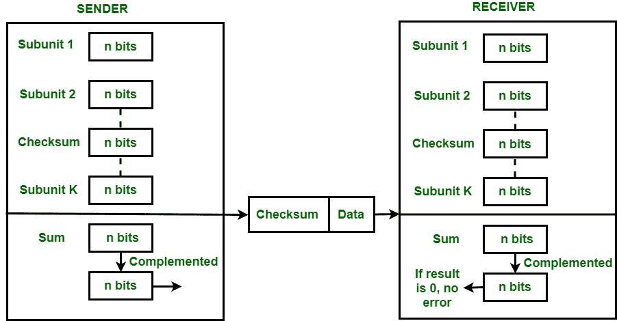

# 错误检测代码–校验和

> 原文:[https://www . geesforgeks . org/错误检测-代码-校验和/](https://www.geeksforgeeks.org/error-detection-code-checksum/)

**先决条件–**[计算机网络中的错误检测](https://www.geeksforgeeks.org/error-detection-in-computer-networks/)

**校验和**是上层协议使用的检错方法，被认为比 LRC、VRC、CRC 更可靠。该方法利用发送端的**校验和生成器**和接收端的**校验和检查器**。

在发送端，校验和生成器将数据分成 n 位长度的相等子单元。该位通常为 16 位长度。然后使用补码方法将这些子单元加在一起。这个总和是 n 位。然后对结果位进行补码。这个被称为校验和的补码和被附加到原始数据单元的末尾，然后被发送到接收器。



接收器在接收到数据+校验和后，将其传递给校验和检查器。校验和检查器将这个数据单元分成长度相等的不同子单元，并将所有这些子单元相加。这些子单元也包含校验和作为子单元之一。然后对结果位进行补码。如果补集结果为零，则表示数据没有错误。如果结果非零，则意味着数据包含错误，接收器会拒绝它。

**示例–**
如果要传输的数据单元是 10101001 00111001，则在发送方站点和接收方站点使用以下过程。

**发射机站点:**

```
10101001        subunit 1  
00111001        subunit 2        
11100010        sum (using 1s complement)       
00011101        checksum (complement of sum)
```

**传输至接收器的数据为–**


**接收站:**

```
10101001        subunit 1  
00111001        subunit 2     
00011101        checksum 
11111111        sum
00000000        sum's complement

Result is zero, it means no error.
```

**优势:**
校验和检测涉及奇数位的所有错误以及涉及偶数位的错误。

**缺点:**
主要问题是如果一个子单元的一个或多个比特被损坏，并且一个子单元的对应的一个或多个比特被损坏，并且第二子单元中的对应的一个或多个相反值的比特也被损坏，则错误不会被检测到。这是因为这些列的总和保持不变。

**示例–**
如果与校验和一起传输的数据是 10101001 00111001 00011101。但目的地收到的数据是**0**0101001**1**0111001 00011101。

**接收站:**

```
00101001              1st bit of subunit 1 is damaged
10111001              1st bit of subunit 2 is damaged
00011101              checksum
11111111              sum
00000000              Ok 1's complement
```

虽然数据已损坏，但错误未被发现。