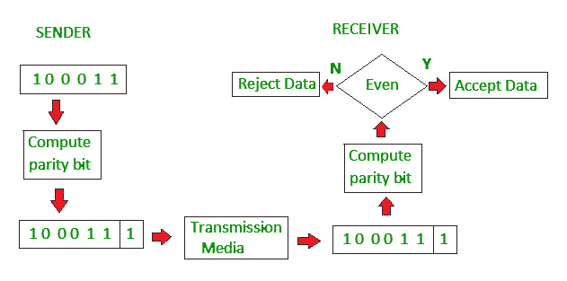
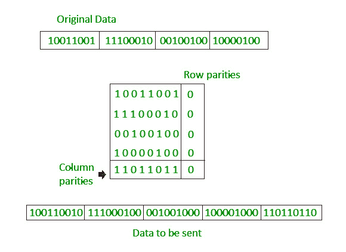
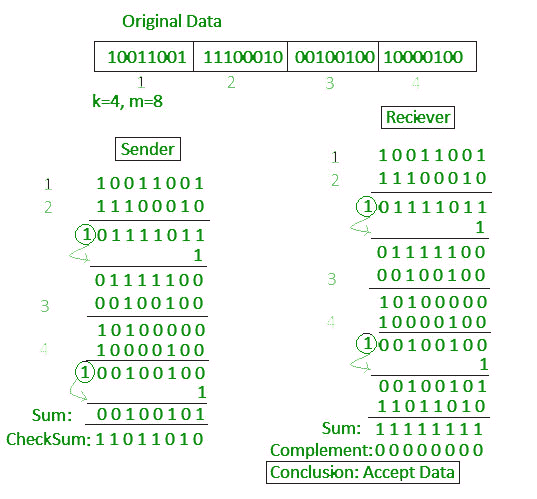
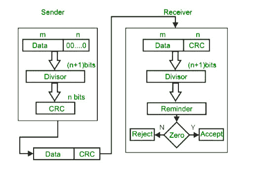
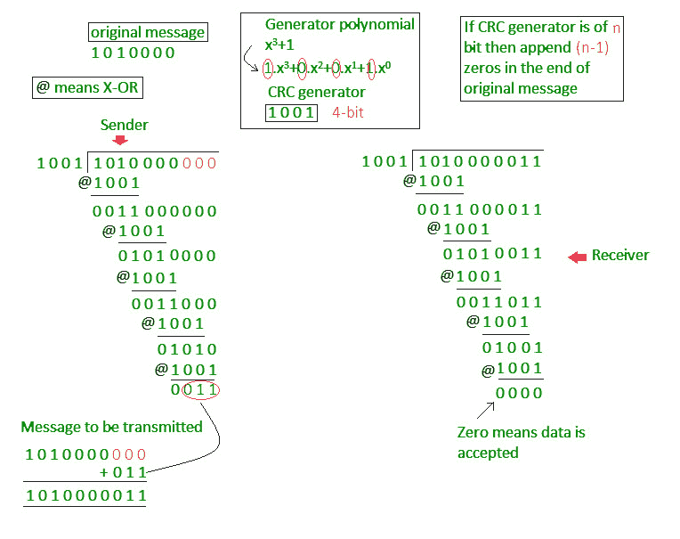

# 计算机网络中的错误检测

> 原文:[https://www . geesforgeks . org/计算机网络中的错误检测/](https://www.geeksforgeeks.org/error-detection-in-computer-networks/)

**错误**
接收方信息与发送方信息不匹配的情况。在传输过程中，数字信号会受到噪声的影响，噪声会在从发送方传输到接收方的二进制位中引入错误。这意味着 0 位可能变为 1，1 位可能变为 0。

**错误检测码(在现场视察模型的数据链路层或传输层实现)**
无论何时传输消息，它都可能被噪声扰乱，或者数据可能被破坏。为了避免这种情况，我们使用检错码，它是添加到给定数字消息中的附加数据，帮助我们检测在消息传输过程中是否发生了任何错误。

用于错误检测的基本方法是使用冗余位，其中添加了额外的位以便于检测错误。

一些流行的错误检测技术有:
1。简单奇偶校验
2。二维奇偶校验
3。校验和
4。循环冗余校验

**1。简单奇偶校验**
来自源的数据块接受校验位或奇偶校验位生成器的形式，其中:

*   如果块包含奇数个 1，则将 1 添加到块中，并且
*   如果包含偶数个 1，则添加 0

这个方案使 1 的总数为偶数，这就是为什么它被称为偶数奇偶校验。

**2。二维奇偶校验**
每行计算奇偶校验位，相当于一个简单的奇偶校验位。还会为所有列计算奇偶校验位，然后两者都与数据一起发送。在接收端，将这些数据与根据接收数据计算的奇偶校验位进行比较。

**3.校验和**

*   在校验和错误检测方案中，数据被分成 k 个段，每段 m 位。
*   在发送端，使用 1 的补码算法将段相加，得到总和。对总和进行补充以获得校验和。
*   校验和段与数据段一起发送。
*   在接收端，使用 1 的补码算法将所有接收的数据段相加，得到总和。总和是互补的。
*   如果结果为零，则接收的数据被接受；否则将被丢弃。

**4。循环冗余校验**

*   与基于加法的校验和方案不同，CRC 基于二进制除法。
*   在循环冗余校验中，称为循环冗余校验位的冗余位序列被附加到数据单元的末尾，这样得到的数据单元就可以被第二个预定的二进制数整除。
*   在目的地，传入的数据单元除以相同的数字。如果在这一步没有余数，数据单元被认为是正确的，因此被接受。
*   剩余部分表示数据单元在运输过程中已损坏，因此必须拒收。

 

**例:**

往年 GATE 试题基于错误检测:
[GATE CS 2009 试题 48](https://www.geeksforgeeks.org/gate-gate-cs-2009-question-48/)
[GATE CS 2007 试题 68](https://www.geeksforgeeks.org/gate-gate-cs-2007-question-68/)

本文由 [Vikash Kumar](https://www.quora.com/profile/Vikash-Kumar-164) 供稿。如果你发现任何不正确的地方，或者你想分享更多关于上面讨论的话题的信息，请写评论。