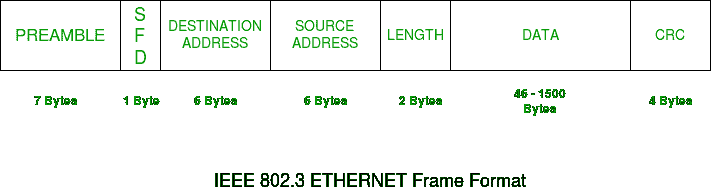
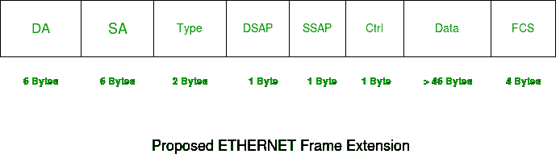

# 以太网帧格式

> 原文:[https://www.geeksforgeeks.org/ethernet-frame-format/](https://www.geeksforgeeks.org/ethernet-frame-format/)

**先决条件–**[以太网简介](https://www.geeksforgeeks.org/local-area-network-lan-technologies/)

所有媒体访问控制实现所需的基本帧格式在 **IEEE 802.3 标准**中定义。虽然有几种可选的格式被用来扩展协议的基本功能。
以太网帧从 Preamble 和 SFD 开始，两者都在物理层工作。以太网报头包含源和目标媒体访问控制地址，之后是帧的有效负载。最后一个字段是用于检测错误的循环冗余校验。现在，让我们研究基本帧格式的每个领域。

### 以太网(IEEE 802.3)帧格式-

*   **前同步码–**以太网帧以 7 字节前同步码开始。这是一种 0 和 1 的交替模式，表示帧的开始，允许发送方和接收方建立位同步。最初，引入 PRE(前同步码)是为了允许由于信号延迟而损失一些比特。但是今天的高速以太网不需要前置码来保护帧位。
    PRE(前同步码)向接收器指示帧即将到来，并允许接收器在实际帧开始之前锁定数据流。
*   **帧分隔符的开始(SFD)–**这是一个 1 字节的字段，始终设置为 10101011。SFD 表示即将到来的位是帧的开始，这是目的地址。有时 SFD 被认为是前同步码的一部分，这就是为什么前同步码在许多地方被描述为 8 字节。SFD 警告一个或多个电台，这是同步的最后机会。
*   **目的地址–**这是一个 6 字节字段，包含数据目的机器的媒体访问控制地址。
*   **源地址–**这是一个 6 字节的字段，包含源机器的媒体访问控制地址。由于源地址始终是单个地址(单播)，因此第一个字节的最低有效位始终为 0。
*   **长度–**长度是一个 2 字节的字段，表示整个以太网帧的长度。这个 16 位字段可以保存 0 到 65534 之间的长度值，但是由于以太网自身的一些限制，长度不能大于 1500。
*   **数据–**这是插入实际数据的地方，也称为**有效载荷**。如果在以太网上使用互联网协议，将在此插入 IP 报头和数据。存在的最大数据可能长达 1500 字节。如果数据长度小于最小长度，即 46 字节，则添加填充 0 以满足最小可能长度。
*   **循环冗余校验(CRC)–**CRC 为 4 字节字段。此字段包含一个 32 位数据哈希代码，它是通过目标地址、源地址、长度和数据字段生成的。如果目的地计算的校验和与发送的校验和值不同，则接收的数据已损坏。

**注意–**以太网 IEEE 802.3 的帧大小从 64 字节到 1518 字节不等，包括数据长度(46 到 1500 字节)。

### 扩展以太网帧(以太网二帧)概述:

上面详细讨论了标准 IEEE 802.3 基本帧格式。现在让我们看看扩展的以太网帧头，使用它我们可以获得甚至大于 1500 字节的有效负载。

**DA** 【目的 MAC 地址】: ***6 字节***
**SA** 【源 MAC 地址】: ***6 字节***
**类型**【0x 8870(ether Type)】:***2 字节***
**DSAP**【802.2 目的服务接入点】:【T0 : ***1 字节***
**Ctrl**【802.2 控制字段】: ***1 字节***
**数据**【协议数据】:***T58】46 字节***
T52】FCS【帧校验和】: ***4 字节***

虽然以太网二帧中缺少长度字段，但由于帧被网络接口接受，因此帧长度是已知的。

**GATE CS 角题**

练习下列问题将帮助你测试你的知识。所有的问题在前几年的 GATE 考试或 GATE 模拟考试中都被问过。强烈建议你练习一下。

1.  [GATE CS 2007，问题 85](https://www.geeksforgeeks.org/gate-gate-cs-2007-question-19/)
2.  [GATE CS 2005，问题 74](https://www.geeksforgeeks.org/gate-gate-cs-2005-question-74/)
3.  [GATE CS 2004，第 90 题](https://www.geeksforgeeks.org/gate-gate-cs-2004-question-54/)
4.  [GATE IT 2005，问题 27](https://www.geeksforgeeks.org/gate-gate-it-2005-question-27/)
5.  [GATE CS 2016(第 2 集)，第 34 题](https://www.geeksforgeeks.org/gate-gate-cs-2016-set-2-question-34/)

**参考文献–**

[扩展以太网帧大小支持](https://www.ietf.org/proceedings/46/I-D/draft-kaplan-isis-ext-eth-00.txt)
[并行](http://www.ciscopress.com/articles/article.asp?p=2348264)
[IEEE 802.3 和以太网](https://www.cse.iitk.ac.in/users/dheeraj/cs425/lec06.html)

本文由 **Abhishek Agrawal** 供稿。如果你喜欢极客博客并想投稿，你也可以用 contribute.geeksforgeeks.org 写一篇文章或者把你的文章邮寄到 contribute@geeksforgeeks.org。看到你的文章出现在极客博客主页上，帮助其他极客。

如果你发现任何不正确的地方，或者你想分享更多关于上面讨论的话题的信息，请写评论。