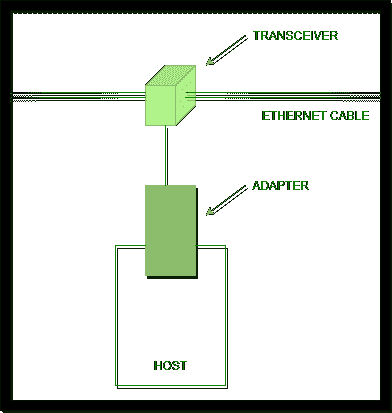
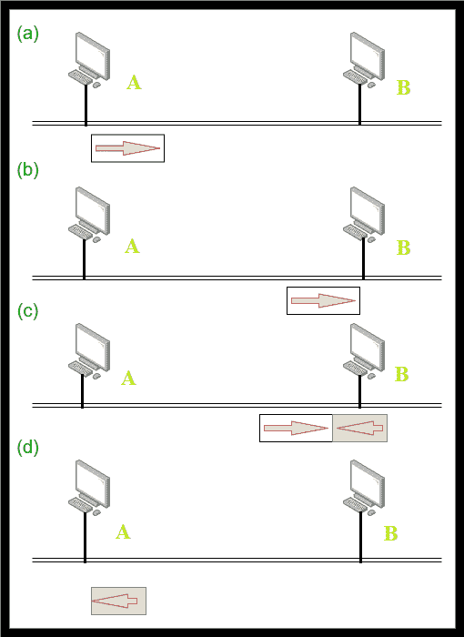

# 以太网发射机算法

> 原文:[https://www . geesforgeks . org/Ethernet-transmitter-algorithm/](https://www.geeksforgeeks.org/ethernet-transmitter-algorithm/)

先决条件–[以太网](https://www.geeksforgeeks.org/local-area-network-lan-technologies/)和[以太网帧格式](https://www.geeksforgeeks.org/ethernet-frame-format/)

**以太网适配器或[网络接口卡(网卡)](https://www.geeksforgeeks.org/nic-full-form/)** 是硬件设备/组件，使您能够向计算机发送数据和从计算机接收数据。它将通过有线或无线连接连接到网络。

假设我们有一台主机，它有以太网适配器。以太网电缆(一种用于将计算设备直接连接在一起的电缆)通过收发器连接到当前的以太网适配器(网卡)，该适配器是主机的一部分，同时充当发送器和接收器。

我们可以将以太网电缆插入以太网适配器(网卡)的端口。但是，为了将以太网电缆连接到以太网适配器(网卡)的端口，我们需要 RJ45 插座(8 针–铜缆连接器上的标准有线以太网)。

**以太网接入协议:**

1.  算法通常称为**以太网媒体访问控制(MAC)** ，在以太网适配器(NIC)上以硬件实现。
2.  以太网的接入方式为**[【CSMA/光盘】](https://www.geeksforgeeks.org/collision-detection-csmacd/)(带冲突检测的载波侦听多路接入)。**
3.  编码方式为**曼彻斯特编码技术**将数据位转换为信号。

采用曼彻斯特编码技术的原因——以太网电缆通过端口连接到以太网适配器。因此，应用层数据被提供给传输层，并被转发到网络层，然后到达数据链路层(现在有网卡)。

因此，主机创建的帧需要放在以太网电缆上(通道上)。当主机想要将数据/信息放在信道上时，我们想要使用一些编码技术。

编码对于将主机产生的特定数据/帧转换成信号至关重要，因为以太网电缆(例如，以电信号形式传输数据的铜缆)只会传输信号。

**以太网发射机算法:**

1.  当适配器(主机)包含要发送的帧，并且线路(信道)空闲时，它立即传输帧。
2.  消息中 1500 字节(以太网帧中数据或有效负载的最大大小)的上限意味着适配器可以占用固定长度的线路。
3.  当适配器包含要发送的帧，并且线路(信道)繁忙时，它等待线路空闲并立即传输。
4.  以太网被称为 CSMA-1 持久协议，因为每当繁忙线路空闲时，适配器都会发送帧，传输概率为 1。
5.  Since, Ethernet has no polarized/centralized control, it is possible for two (or more) Ethernet Adapters to start transmitting frames at identical time, either because both found path/line to be idle or both had been watching for busy line to become idle. Example – Let us assume that there are 2 host computers, connected to Ethernet cable. When both find line idle, they place their frames at identical time and this results in collision.

    当帧相互碰撞时，以太网没有集中控制，该算法(以太网发送器算法)将告知主机发生了碰撞。这就是为什么以太网接入方式被命名为 CSMA/光盘的原因。

6.  当两个以太网适配器同时开始传输帧时，帧往往会在网络上发生冲突。
7.  因为以太网支持冲突检测，所以每个发送者都能够看到冲突正在进行。
8.  At the instant, when adapter detects that its frame is striking another frame, it makes it obvious to transmit 32-bit jamming sequence instantly (so that, other hosts know that collision has happened) and thus, host computer stops transmission presently.

    **注意–**
    干扰序列是工具在以太网上发送的信号，表示网络上发生了冲突。32 位长度是必需的，并且足够长以遍历整个冲突域，以便所有发射站能够检测冲突)。

9.  Thus, transmitter will minimally send 96 bits just in case of collision. **64-bit preamble + 32-bit jamming sequence**.

    **注意–**
    前导码用于位同步，例如 8 字节的前导码和帧的开始创建 64 位的模式。

主机需要发送 96 位的原因:主机应该发送 32 位的干扰序列，点对点冲突继续，仅仅 32 位是不够的。因此，它必须附加 64 位前导码。

**Runt Frame :**
我们知道以太网不会创建任何小于最小长度 64 字节的帧。可以看出，短帧通常是由冲突引起的。当两帧碰撞时，导致碰撞，产生“欠帧”。

欠帧的其他原因有:

1.  网卡/网卡故障。
2.  缓冲区欠载运行(当缓冲区习惯于两个设备之间的通信，或者进程以比从中读取的数据/信息更慢的速度获得数据时，就会出现这种状态)。
3.  双工不匹配(线路一端以半双工模式运行，另一端以全双工模式运行)/软件问题。

**以太网发射机算法–最坏情况场景:**

1.  ' a '(主机)在时间' t1 '发送帧。
2.  a 的帧在时间‘t1+D1’到达‘B’(目的计算机)。(“d1”:传输或传播延迟)。
3.  ' b '在时间' t1+d1 '开始传输，并与 A 帧碰撞。
4.  b '剩余帧(32 位)在时间' t1+2d1 '到达 A。

让我们假设帧中有 200 位，除了最后一位，所有位都由“B”发送和接收。' B '接收最后一位时间，与' B '开始传输时间相同。因此，会发生单个位冲突。这里，当‘B’在‘t1+D1’开始传输时，来自‘A’的帧同时到达‘B’，即‘t1+D1’。因此，两个帧都变得不可用。该帧成为不完整帧。“B”开始传输帧的时间是“t1+d1”，因此帧到达“A”的时间是“t1+D1+D1”=“t1+2d 1”。

**指数回退:**

*   指数回退是以太网用来降低冲突概率的技术。
*   一旦以太网适配器检测到冲突并停止，它就开始传输/传送，等待一定的时间。
*   展望一定时间后，以太网适配器再次尝试传输。如果以太网算法仍然发现信道繁忙，它会加倍等待时间，然后再重试。如果节点最初等待 1 秒钟，那么它将等待 2 秒钟，然后 4 秒钟，然后 8 秒钟，直到信道空闲。
*   当通道最终空闲时，以太网适配器将帧放入通道。
*   这种将每次转运尝试之间的延迟间隔乘以两倍的策略称为“指数回退”。