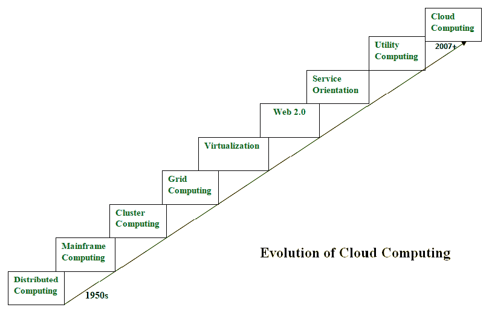

# 云计算的演进

> 原文:[https://www.geeksforgeeks.org/evolution-of-cloud-computing/](https://www.geeksforgeeks.org/evolution-of-cloud-computing/)

云计算就是出租计算服务。这个想法最早出现在 20 世纪 50 年代。在成就今天的云计算的过程中，五项技术发挥了至关重要的作用。这些是分布式系统及其外围设备、虚拟化、web 2.0、面向服务和实用计算。

*   **Distributed Systems:**
    It is a composition of multiple independent systems but all of them are depicted as a single entity to the users. The purpose of distributed systems is to share resources and also use them effectively and efficiently. Distributed systems possess characteristics such as scalability, concurrency, continuous availability, heterogeneity, and independence in failures. But the main problem with this system was that all the systems were required to be present at the same geographical location. Thus to solve this problem, distributed computing led to three more types of computing and they were-Mainframe computing, cluster computing, and grid computing.

*   **Mainframe computing:**
    Mainframes which first came into existence in 1951 are highly powerful and reliable computing machines. These are responsible for handling large data such as massive input-output operations. Even today these are used for bulk processing tasks such as online transactions etc. These systems have almost no downtime with high fault tolerance. After distributed computing, these increased the processing capabilities of the system. But these were very expensive. To reduce this cost, cluster computing came as an alternative to mainframe technology.
*   **Cluster computing:**
    In 1980s, cluster computing came as an alternative to mainframe computing. Each machine in the cluster was connected to each other by a network with high bandwidth. These were way cheaper than those mainframe systems. These were equally capable of high computations. Also, new nodes could easily be added to the cluster if it was required. Thus, the problem of the cost was solved to some extent but the problem related to geographical restrictions still pertained. To solve this, the concept of grid computing was introduced.
*   **Grid computing:**
    In 1990s, the concept of grid computing was introduced. It means that different systems were placed at entirely different geographical locations and these all were connected via the internet. These systems belonged to different organizations and thus the grid consisted of heterogeneous nodes. Although it solved some problems but new problems emerged as the distance between the nodes increased. The main problem which was encountered was the low availability of high bandwidth connectivity and with it other network associated issues. Thus. cloud computing is often referred to as “Successor of grid computing”.
*   **Virtualization:**
    It was introduced nearly 40 years back. It refers to the process of creating a virtual layer over the hardware which allows the user to run multiple instances simultaneously on the hardware. It is a key technology used in cloud computing. It is the base on which major cloud computing services such as Amazon EC2, VMware vCloud, etc work on. Hardware virtualization is still one of the most common types of virtualization.
*   **Web 2.0:**
    It is the interface through which the cloud computing services interact with the clients. It is because of Web 2.0 that we have interactive and dynamic web pages. It also increases flexibility among web pages. Popular examples of web 2.0 include Google Maps, Facebook, Twitter, etc. Needless to say, social media is possible because of this technology only. In gained major popularity in 2004.
*   **Service orientation:**
    It acts as a reference model for cloud computing. It supports low-cost, flexible, and evolvable applications. Two important concepts were introduced in this computing model. These were Quality of Service (QoS) which also includes the SLA (Service Level Agreement) and Software as a Service (SaaS).
*   **效用计算:**
    它是一种计算模型，定义了服务的服务供应技术，如计算服务以及其他主要服务，如存储、基础架构等，这些服务是按使用付费的。

因此，上述技术促成了云计算的产生。